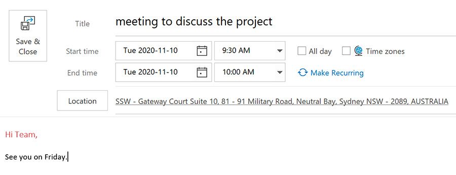
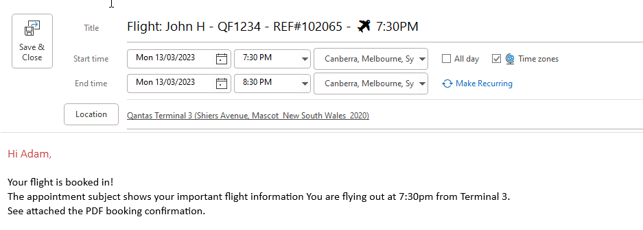

When sending an appointment, it's a good idea to choose your subject/title intelligently so that people can see all the information they need to see on the Subject of the Appointment.

For example, if the appointment is a meeting request you should include the names of the persons attending that appointment. 

For hotel bookings, include the Hotel name in the Appointment Subject and address in the location. 

For flight bookings, include the Name and flight number (⚠️as a minimum), plus the booking number and departure time in the subject. i.e. Flight: John H - QF1234 – REF#102065 – 7:30pm. Its also wise to include the exact location in the appointment, specifically the Terminal number. 

This will help make it as clear as possible, and you can see the relevant information without even opening the appointment.
If all else fails, attaching the airline booking confirmation PDF to the appointment is a great failsafe.
 
When booking flights, to ensure nothing is missed, read through this rule: [do-you-know-how-to-create-an-appointment-in-the-outlook-calendar-for-flights/](/do-you-know-how-to-create-an-appointment-in-the-outlook-calendar-for-flights/)

Include the rule (Link) on the appointment. This will ensure you have quick access when double checking you have all the relevant info.

<!--endintro-->

::: bad\

:::

::: good\

:::

CRM users making bookings should [keep their naming standards consistent.](/scheduling-do-you-have-a-consistent-naming-convention-for-your-bookings)

Related rules

* [Do you realize the importance of a good email Subject?](/do-you-realize-the-importance-of-a-good-email-subject)
* [Scheduling - Do you have a consistent naming convention for your bookings?](/scheduling-do-you-have-a-consistent-naming-convention-for-your-bookings)