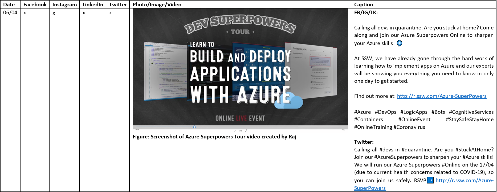

​​​​Creating content can be exhausting. Often you're planning it weeks in advance, with many different posts and platforms involved. This can lead to mistakes such as typos, or wrong URLs. It's always a good idea to get someone else to do a "test please" on your content before you post it. This will help make sure your content doesn't have any issues that will compromise the user experience while consuming it, or even affect your business goal with the post. 
 

 <excerpt class='endintro'></excerpt> 

​He​re are some tips that you can use to improve your content approval process:

<ol><li>Use a template that you can easily fill in and that is also easy for people to understand what you want to post and when </li><li>Block a day to work on the content ​to create a routine </li><li>Define a process that you can follow: Create content &gt; Get images approved by designers &gt; Get content approved by Management OR improve content based on feedback. If your process is not efficient and adds a lot of blockers to your work routine, then it is not effective </li><li>Commit to a deadline - Try to work out what the timeline will be, from creation to review </li><li>Use a branding guide to be consistent with the brand's look and feel </li><li>Encourage specific feedback (Eg. feedback like "I don't like this design" won't help you improve it) </li><li>Reduce the rounds of approval - In this process, you should only include only people that have the skills and capacity to analyze your content goal, and consequently the content itself </li><li>Always​ think of your personas when creating content - who are you trying to target? </li></ol><dl class="ssw15-rteElement-ImageArea"><strong><dl class="ssw15-rteElement-ImageArea"><strong></strong></dl></strong><strong>Figure: Example of a template you can use to get approval for your social media content, note it shows what platforms it will be posted on, when, the test and how it will look. It will also help give you an idea of what your feed will look like to ensure it has a nice balance of images.​</strong> </dl> 

