A good architecture diagram (aka a cloud architecture diagram or system architecture diagram) gives a great overview of your project. An architecture diagram lets you see at a glance what the overall structure of the solution is. This is useful for gaining an understanding of how the system fits together, how it flows, and what it does. It also helps to easily show which components can be improved due to updated or better components (or improved architectural guidelines).

`youtube: https://www.youtube.com/embed/ek8ArrOfJxA`

An architecture diagram is useful when:

<!--endintro-->

* In the initial discussion with a client (see Brendan Richards' quote below)
* You are onboarding a new developer
* You have been deep into one aspect of the system and need a refresher on another area
* You have been off the project for a while
* Whenever you are discussing requirements that may require structural changes

The architecture diagram is a technical diagram that demonstrates the technology in use. The purpose of the architecture diagram is to show how a solution has been built and what the technical dependencies are. It is not used for user journeys or business logic.

::: info
Check out the [8 Tips to Better Architecture Diagrams](https://adamcogan.com/2020/10/07/8-tips-to-better-architecture-diagrams/).
:::

::: bad img-medium
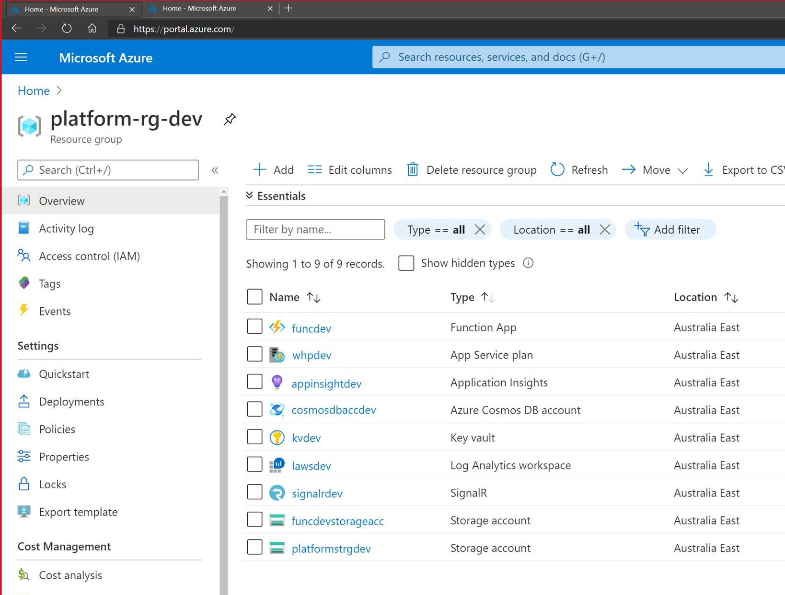
:::

Depending on the complexity of your solution and your comfort/familiarity with the tools, an architecture diagram could take you anywhere from half an hour to a couple of days.

> Usually, the longer an architecture diagram takes you to make, the more important it is for your project.
>
> * Matt Goldman, Software Architect

An architecture diagram is part of the 7 crucial documents you need for your project, see our rule: [Do you make awesome documentation?](/do-you-review-the-documentation)

### Tip #1: Include your most important components

At a minimum, your architecture diagram should include:

* Your data repository
* Your business logic component
* Your UI

Your diagram needs to include the relationships between these components, and how they share and process data.

### Tip #2: Don't use a .NET Dependency Graph as a Architecture Diagram

The .NET dependency diagram is a useful tool, but it drills down into a specific component of the solution (the code) while ignoring the rest of it (the infrastructure). If it adds value to your documentation (i.e., there is a specific reason to include it) you can include the .NET dependency diagram, but don't use it here in place of the architecture diagram.

See SSW rule: [Do you generate the VS Dependency Graph?](/do-you-generate-the-vs-dependency-graph)

::: bad img-medium
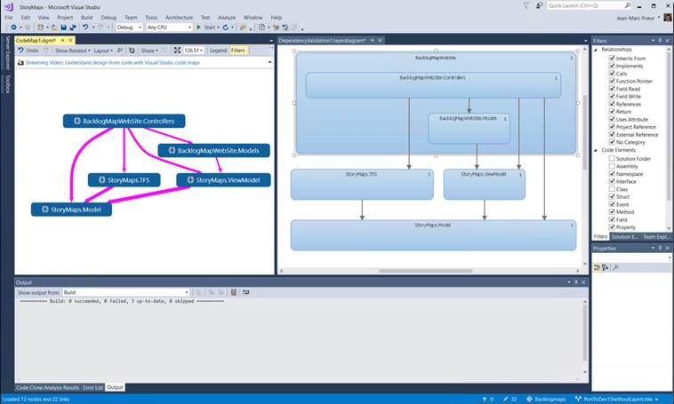
:::

### Tip #3: Show data dependencies and data flows

Your architecture diagram should show how the components of your solution fit together. It should also show **how** the components of the architecture depend on each other for functionality, as well as upstream and downstream data dependencies.

::: ok img-medium
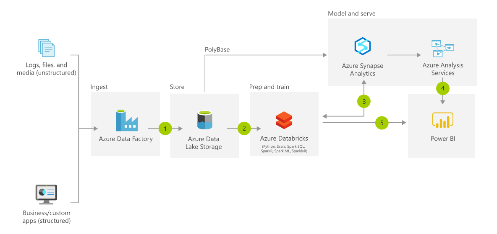
:::

### Tip #4: Put data at the top

Pick a direction for your data flow, and keep it consistent across all your documentation. Where there are exceptions (for example data going to analytics or to/from partner sources) make these perpendicular to the primary data flow direction.

It should be easy to tell at a glance which direction data flows in your diagram - **top to bottom is recommended**.

::: good img-medium

:::

### Tip #5: Group relevant components

Group components logically by enclosing them in a box. Components that operate independently can stand alone, and those that work together to deliver a logical function can be grouped together. Also show components that are out of scope, i.e. important for understanding the architecture but not necessarily part of it, e.g. legacy components, partner components, or components that have not been implemented yet.

**Note:** For clarity, out of scope items whether one or many, should be in a box.

::: good img-medium
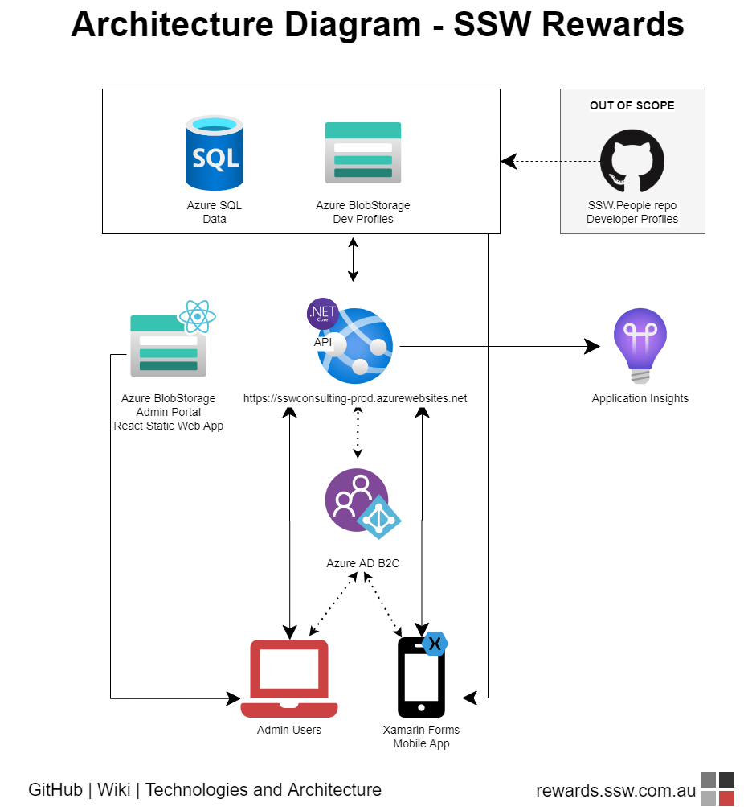
:::

### Tip #6: Start with paper...

Make sure you use the right tools when creating your architecture diagrams. There's nothing wrong with starting out with pen and paper, but your hand-drawn sketch should not be considered your 'done' final architecture diagram. If you want to save paper, and increase collaboration, a great alternative is the trusty old whiteboard.

For me its all about building a shared understanding between the client and the developers. Most pieces of software architecture I do, work starts by building a rough solution architecture diagram on a whiteboard. 

Putting something on a whiteboard is "low risk" for the participants as its really easy to wipe and redraw. It allows us to start working together straight away, building a shared understanding of what we're trying to achieve. There is no software or skills required to participate in whiteboard collaboration. 

> A key milestone in the early engagement is the first time a client takes the pen and starts using the whiteboard to explain something to me. Early use of the whiteboard is all about immediate communication. Later, the solution design starts to solidify and we can then use the last state of the whiteboard to make out first architecture diagram.
>
> * Brendan Richards, SSW Solution Architect

::: ok img-medium
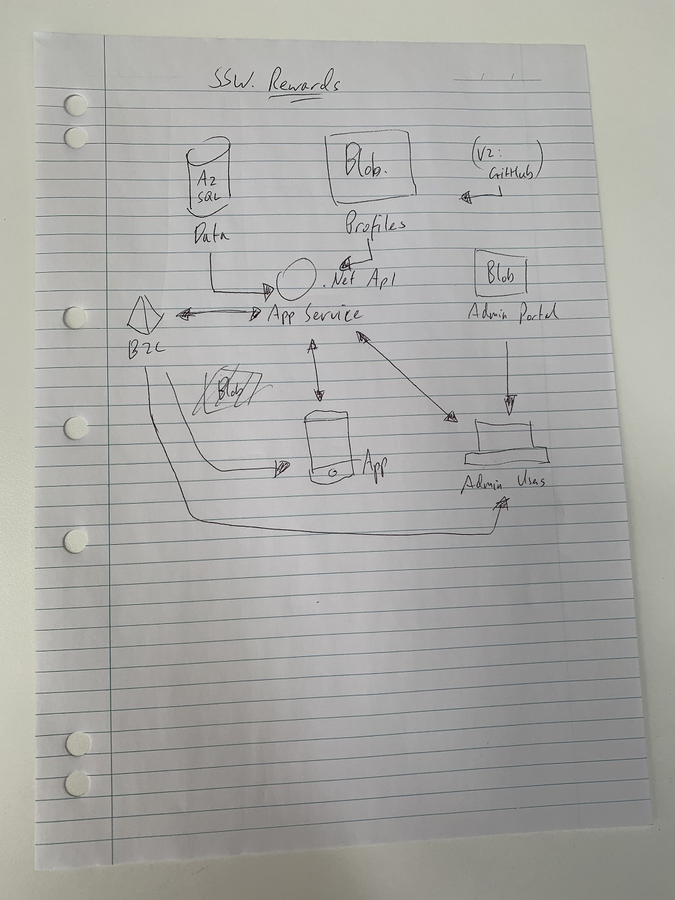
:::

**Tip:** [Microsoft Office Lens](https://www.google.com.au/url?sa=t&rct=j&q=&esrc=s&source=video&cd=&cad=rja&uact=8&ved=2ahUKEwi6-NTb1MvrAhWXA3IKHevqC-MQtwIwAHoECAEQAQ&url=https://www.youtube.com/watch?v%3DjzZ3WVhgi5w&usg=AOvVaw25XKH6ZRcPfM5jaVajFOlH) is a free mobile app that uses your smartphone camera to capture scan-like images of documents, photographs, business cards, and whiteboards (including searchable handwritten text).

::: good img-medium
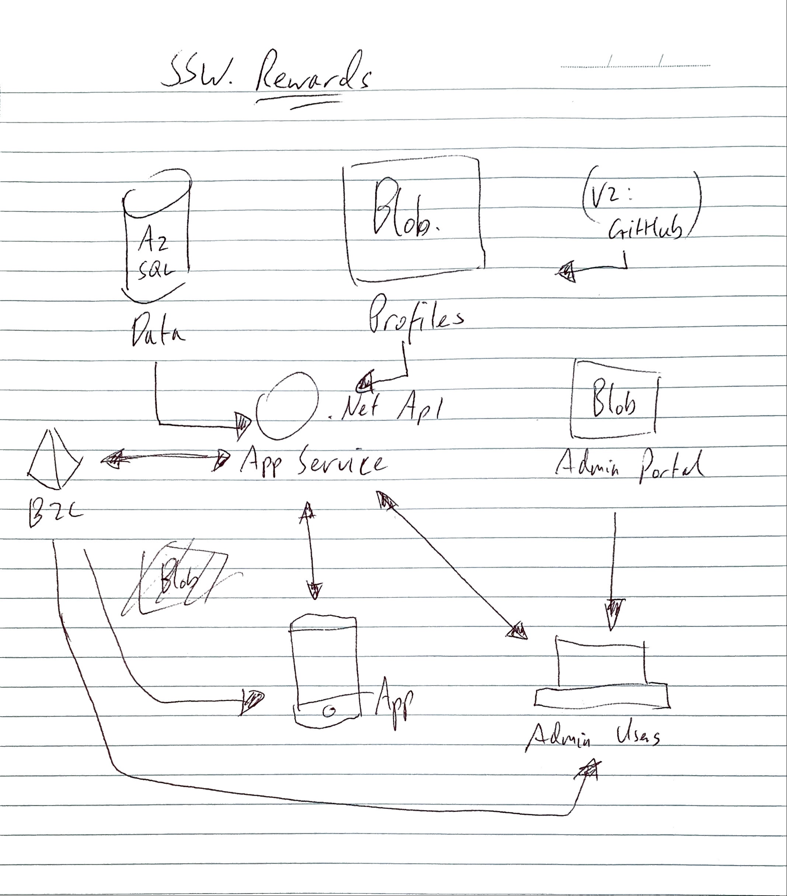
:::

### Tip #7: ...and Finish up with Diagrams.net

The best tool for creating these diagrams is [diagrams.net](https://diagrams.net/) (previously draw.io). All the examples on this page were created with this tool.

It is definitely the most popular diagram tool at SSW:

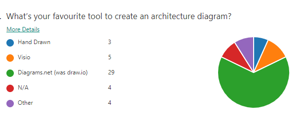

::: good img-medium
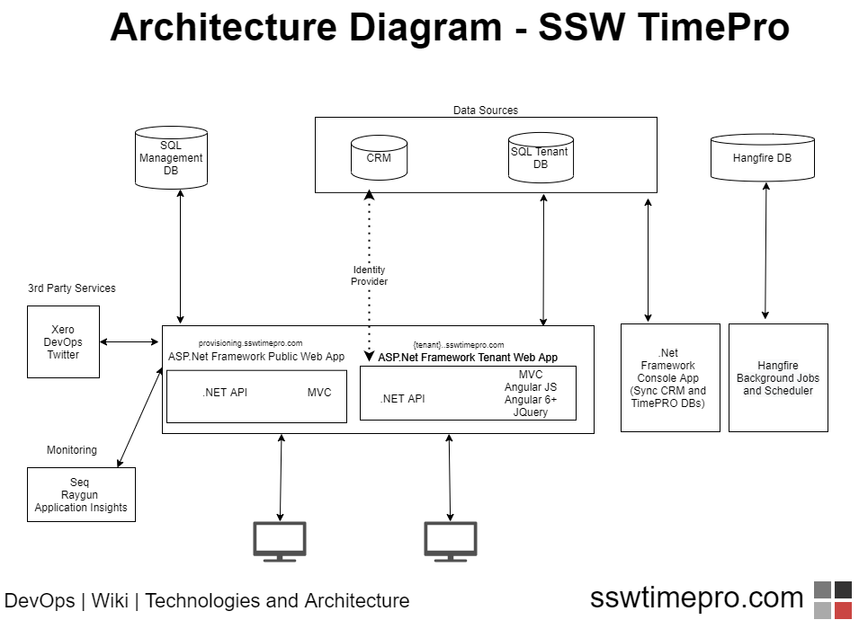
:::

Diagrams.net is free, can be used in the browser, or can be downloaded as a desktop app. But the best way to use diagrams.net is to integrate it directly into VS Code.

::: good img-medium
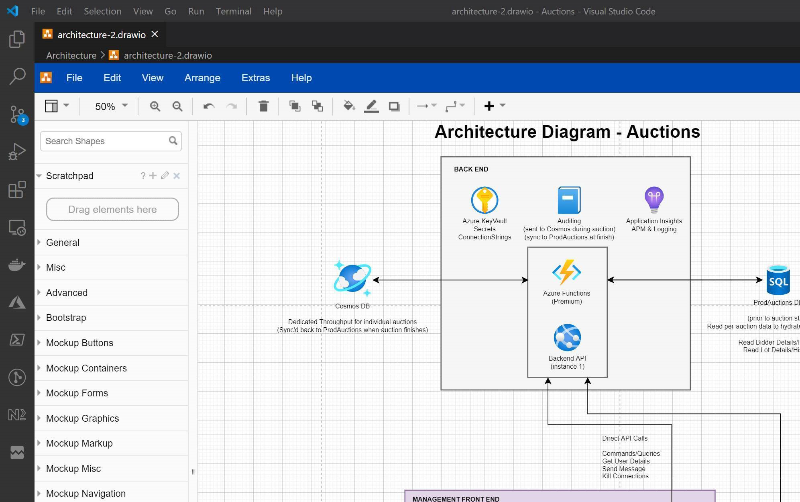
:::

There are multiple extensions available that let you do this, the best one is [VS Code | Extensions | Draw.io Integration](https://marketplace.visualstudio.com/items?itemName=hediet.vscode-drawio). This makes it easy to create and edit the architecture diagram right alongside the code, and check-in with the relevant commits.

::: good img-medium
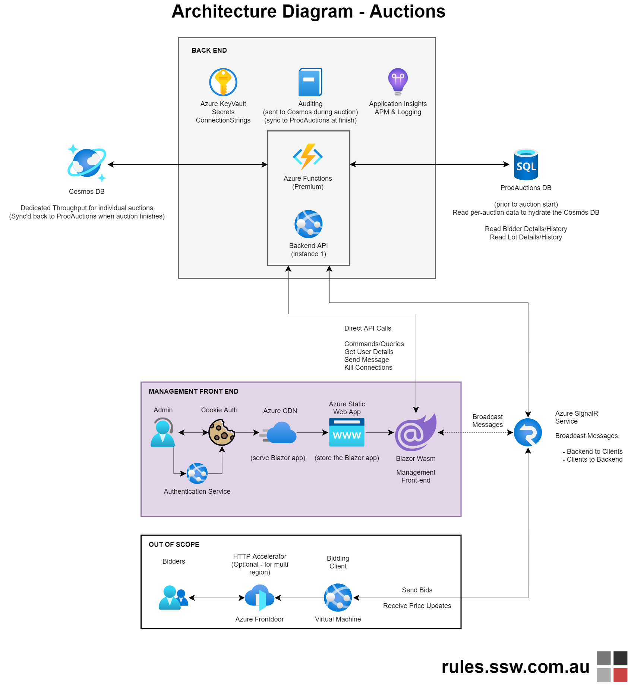
:::

### Tip #8: Polish up Diagrams.net

Maintain standards to keep your diagrams consistent:

* Title - Naming Convention. E.g. Architecture Diagram - {{product name}}
* Title - Standard font size. E.g. 43pts
* Standard font. E.g. Helvetica bold
* Standard arrowhead sizes. E.g. 14pts
* Doc details - at the bottom left, add file location. E.g. DevOps | Wiki or GitHub | Repo | Docs, in font size 22pts
* Doc details - at the bottom right, add branding and URL E.g. {{logo image}} - url.com, in font size 22pts
* Add color and icons to make your diagrams engaging and easier to distinguish

::: good img-medium
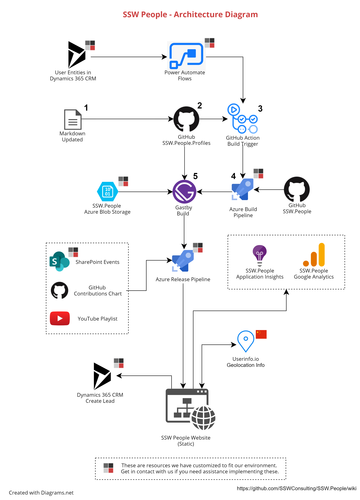
:::

### Tip #9: Where to store Diagrams?

Standardizing where your organisation stores architecture diagrams ensures a consistent experience among developers. Therefore store your architecture diagrams in the repo **docs**\ folder. Additionally, the \README.md (in the root) should have a link and an embedded image of the high-level architecture diagram (from the **docs**\\* folder). 

**Note:** If you have a Wiki, for visibility add an architecture diagram page and embed the images from the **docs**\\* folder.

### Tip #10: Use Azure Architecture Center

[Azure Architecture Center](https://docs.microsoft.com/en-us/azure/architecture/) is the best tool to help you figure out the pieces you need for an architecure diagram - see [SSW.Rules | Do you use Azure Architecture Center](/azure-architecture-center)

### Alternatives to Diagrams.net

**Miro (by Adobe)**

[Miro](https://miro.com/) is an online tool designed primarily for whiteboard-style collaboration. It is very easy to use and optimised for this purpose. As a diagramming tool, it is lacking in features compared to Diagrams.net, but it can be used to create simple diagrams.

**Note:** The paid version of Miro gives you Azure Architecture Diagram templates - see [miro.com/templates/azure-architecture-diagram/](https://miro.com/templates/azure-architecture-diagram/)

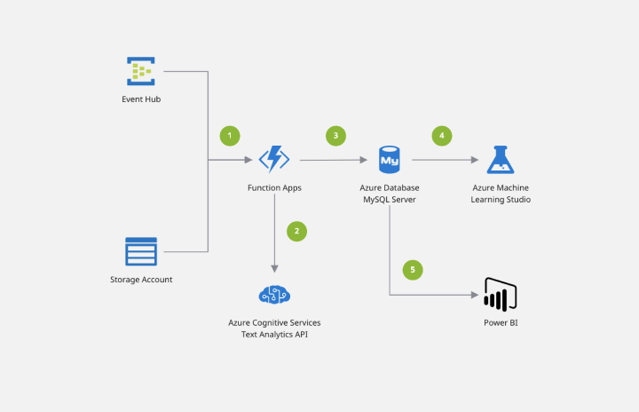

**Mermaid**

If you really want to geek out and use markdown, you can try [Mermaid](https://mermaid.live) to build simple diagrams.
