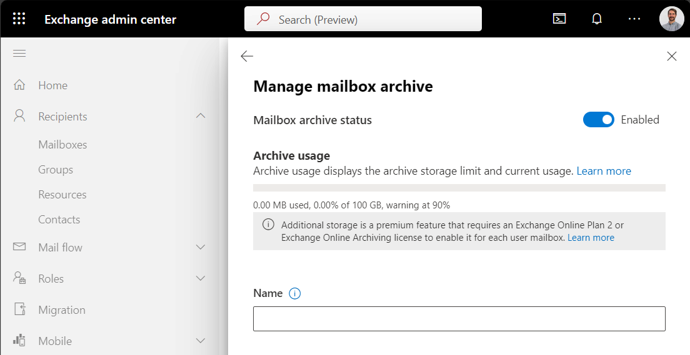
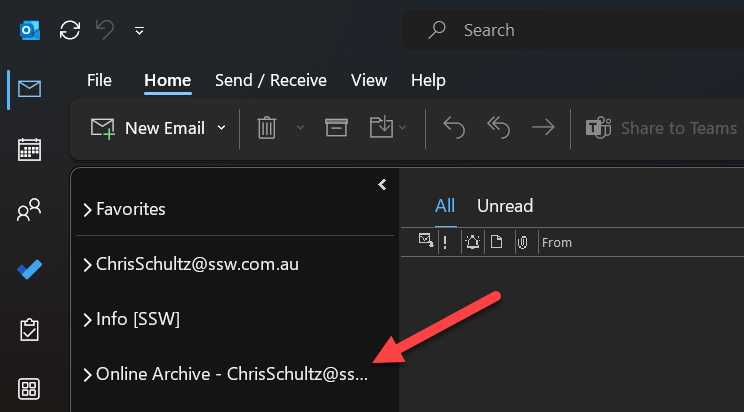
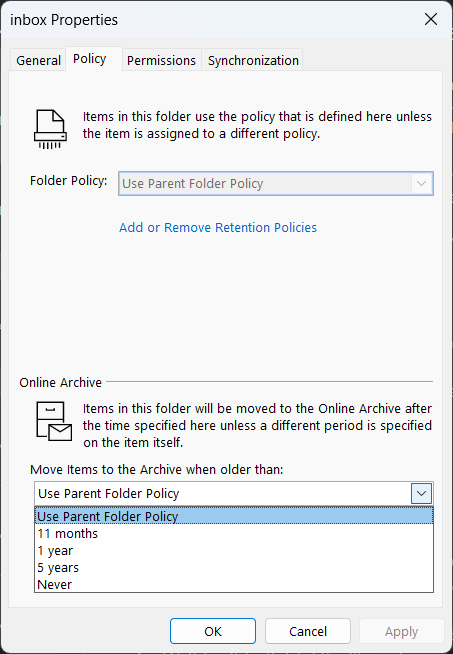
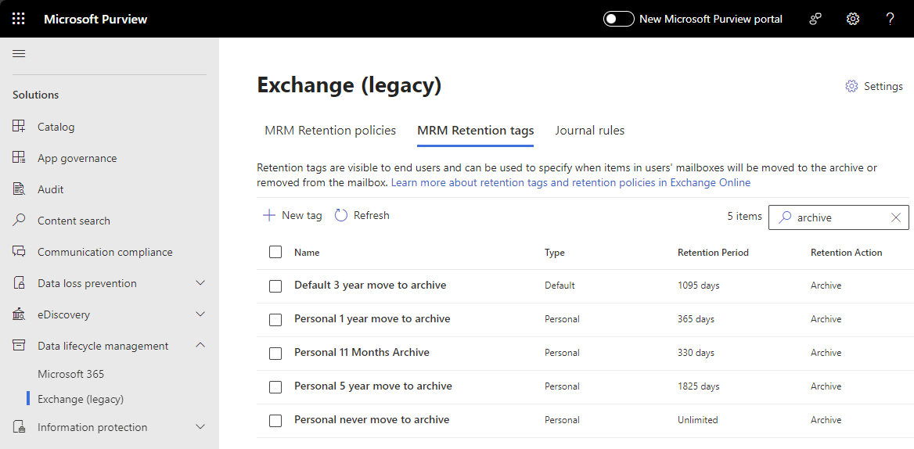

In Microsoft 365, user mailboxes are limited to 50GB or 100GB, [depending on the licence you have](https://learn.microsoft.com/en-us/office365/servicedescriptions/exchange-online-service-description/exchange-online-limits#storage-limits?WT.mc_id=M365-MVP-33518). For users with lots of emails, you need a solution to keep mailboxes under the limit, without losing data or access to emails.

There are 3 ways to "archive" emails in Outlook/Exchange, however there's only one true archive option that should be used - **Archive Mailboxes** (also called Online Archive, or In-Place Archiving).

<!--endintro-->

This video explains the 3 "archiving" options in Outlook (skip to 4:43 for Archive Mailboxes).

`youtube: https://www.youtube.com/embed/UuPuBPFexvU`
**Video: Are you using the Right "Archive" in Outlook? (7 min)**

**In Summary:**\
❌ **Archive folder** - just another folder in your mailbox\
❌ **Auto-Archive** - stored on your computer, not available online (you will lose data!)\
✅ **Archive Mailboxes** - the right solution!

* Archive Mailboxes give you 50GB or 1.5TB(!) of extra storage, depending on your licence.
* They are stored in the cloud - no lost data
*  They are accessible in Outlook on all devices

## Enable Archive Mailboxes

1. Go to the **[Exchange admin center](https://admin.exchange.microsoft.com/) | Mailboxes** 
2. Select a user
3. Go to **Others | Manage mailbox archive**
4. Change **Mailbox archive status** to **Enabled**
5. (Optional) Add a name - if no name is added, it will default to **Online Archive**
6. Click **Save**

Users will see their new Online Archive as a separate mailbox in Outlook

## Archive Policies

By default, emails will be moved to the archive mailbox after 2 years. Users can select a different archiving policy per folder by going to the Outlook folder **Properties | Policy**.

Admins can edit the default policy, or add new policy options in **[Microsoft Purview](https://compliance.microsoft.com/) | Data lifecycle management | Exchange (legacy)**

* Use the **MRM Retention Tags** tab to create archive time-frame options, e.g. archive after 3 years
* Use the **MRM Retention Policies** tab to apply default and/or optional policies to users

For more information see Microsoft's documentation: https://learn.microsoft.com/en-us/purview/archive-mailboxes?WT.mc_id=DP-MVP-33518
