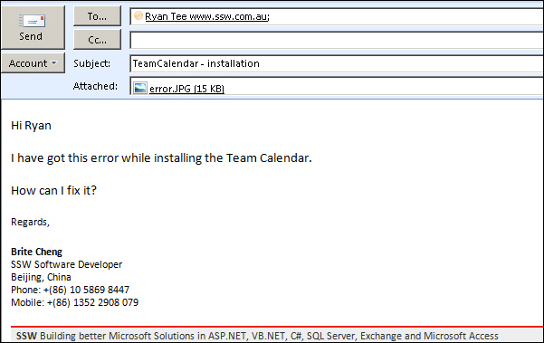
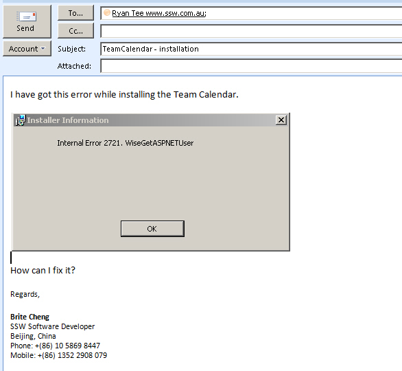

Sometimes clients will add attachment files into emails. Those files could be documents or images, which may contain details or solutions of the issue, or some helpful information. 
To keep the history, it is very important to embed the attachment files into the email since it's easy to lose those files when responding.

 <excerpt class='endintro'></excerpt> 

  ​​

Figure: Bad Example - The image is in attachment.  
 
Figure: Good Example - The image is included in the context. 
PS: Clients make attachments because they are using OWA and you can't paste an image in - see suggestion for OWA 

 

