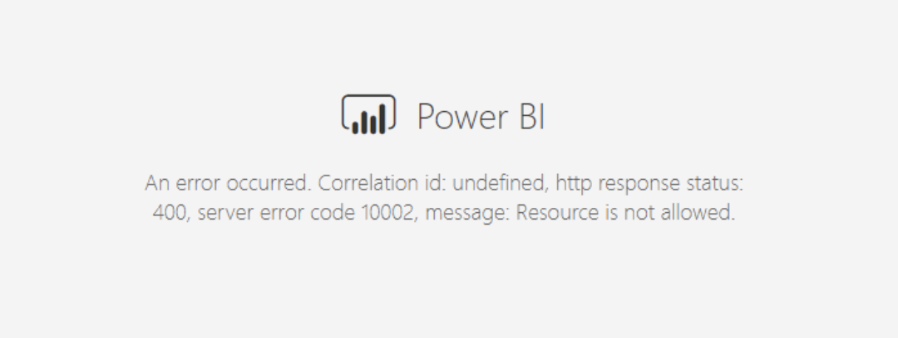

Implement a policy of following up **important** conversations (usually by phone or IM) with an email that begins with the words "As per our conversation". The intent is to document what was said and agreed upon.

When possible, the even better way of confirming requirements is to actually [share screens](/do-you-share-screens-when-working-remotely) of the drafted requirements and add the words [“<mark>checked by XXX</mark>”](/do-you-know-when-to-do-use-checked-by-xxx).

Watch the video below and see how a single email can make your job easier.
 
`youtube: https://www.youtube.com/embed/falcO6smD_8`

<!--endintro-->

::: email-template  
|          |     |
| -------- | --- |
| To:      | John |
| Subject: | Spec Review for Northwind |  
::: email-content  

### Hi John,  
<mark>As per our conversation,</mark> I am going to offer the client a Spec Review for $XXX   

:::  
:::  
::: good
Figure: Good Example - using "As per our conversation" email
:::

This is not just a 'cover my ass' email. This is for several reasons:

* To make sure that you did not get the message wrong
* To keep an audit trail of agreed decisions
* To keep people, who were not a party to the conversation, informed about the progress

Use this approach internally and with clients. As a result, expect to see "as per our conversation" emails that:

* **Require a task to be completed**
* Explain the logic of the decision
* Include URLs that were referred to
* Can be referred back to in the future 

Sometimes you might not reach the client or Product owner via phone and have to make a decision by yourself. In this case, it's still important to record everything in an email, starting with "I tried calling you but didn't get through":

::: email-template  
|          |     |
| -------- | --- |
| To:      | John |
| Subject: | Spec Review for Northwind |  
::: email-content  

### Hi John,  
<mark>I tried calling you but didn't get through.</mark> I am going to offer the client a Spec Review for $XXX    

:::  
:::  
::: good
Figure: Good Example - for when you can't reach the person by phone   
:::

::: info
**Notes:** 
- This is most likely to happen after a conversation started **by the client**. If **you** are the one making the first contact, also follow: [Do you prepare, then confirm conversations/decisions?](/do-you-prepare-then-confirm-conversations-decisions)
- For a major architectural decision, etc. that could be difficult or expensive to change later, which was made against your recommendation, consider sending a ["For the record" email](/do-you-send-a-for-the-record-email-when-you-disagree).
:::

It's easy to fall into the trap of sounding rather robotic if you start every email with "As per our conversation", or "As per the message I just left on your mobile", etc. Here's a list of nice email openers that have the same effect:

"As per our conversation" alternatives:

* Thanks for the chat
* Good talking to you
* As discussed...

"As per the message I left on your mobile" alternatives:

* I couldn't catch you on the phone today.
* I just left you a quick voicemail.
* I called earlier but couldn't get through.
* Hey I just called earlier to say...

#### Other cases exist, include your reason at the top

::: email-template  
|          |     |
| -------- | --- |
| To:      | John |
| Subject: | RE: PowerBi error |  
::: email-content  

### Hi John,  

Apologies for the brevity. Am still in the hospital but wanted to check this.

:::  
:::  
::: bad
Figure: Bad example - reason at the bottom
:::

::: email-template  
|          |     |
| -------- | --- |
| To:      | John |
| Subject: | RE: PowerBi error |  
::: email-content  

### Hi John,  

Apologies for the brevity. Am still in the hospital but wanted to check this.

:::  
:::  
::: good
Figure: Good example - reason at the top
:::

**Video** - [Top 10+ Rules to Better Email Communication with Ulysses Maclaren](https://www.youtube.com/watch?v=LAqRokqq4jI)
