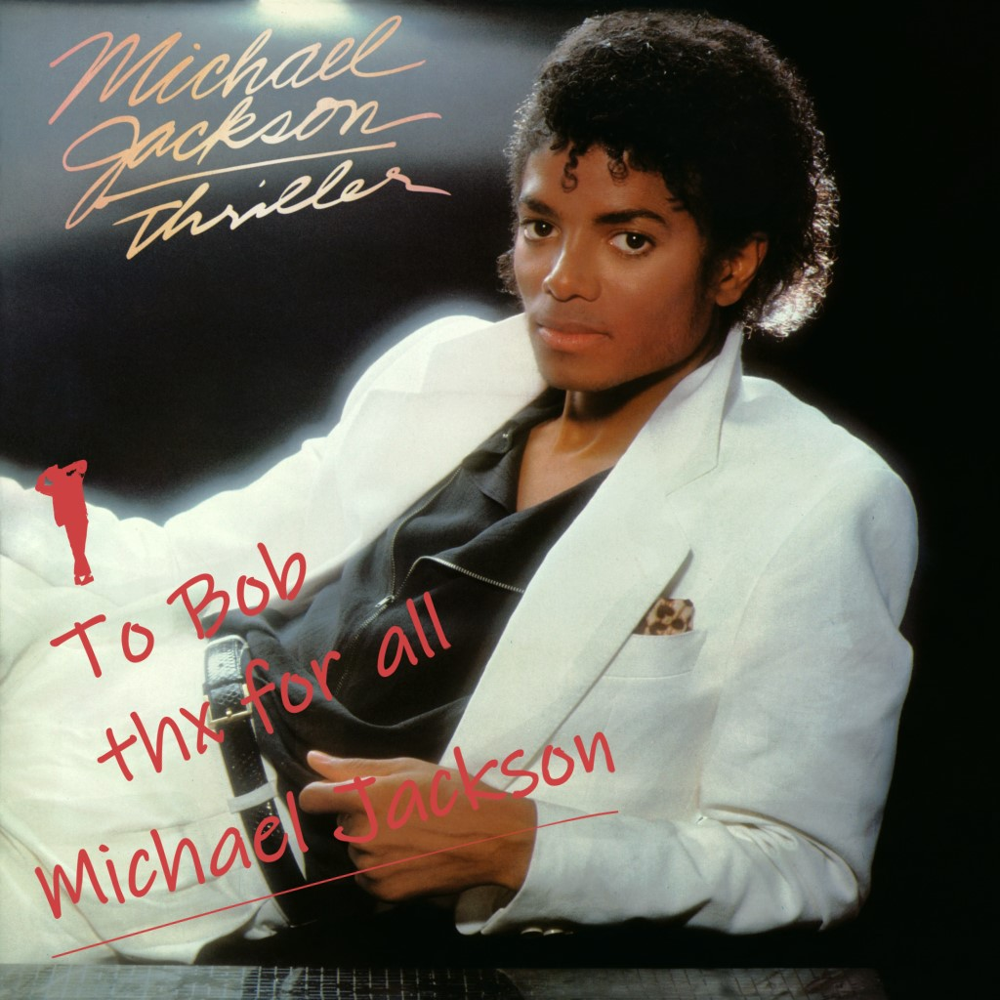

Requesting a **signature** (or simply an initial) on non-contractual documents, such as screenshots, mockups, or data schemas, is valuable for several reasons. 

It provides tangible evidence of receipt and agreement, especially beneficial for visual materials. It establishes a clear record of communication and collaboration, preventing potential misunderstandings or disputes. This practice also promotes a culture of accountability and ownership among teams or stakeholders.

<!--endintro-->

::: img-medium 

:::

`youtube: https://www.youtube.com/embed/cyi4lXFmztI`

**Video: ''Michael Jackson rule"' Ask Clients for Approval | Adam Cogan (5 min)**

A person's signature is extremely valuable. Getting a signature is hard work. Salespeople use all sorts of euphemisms to avoid that confronting request: _"...if you could just sign here..."_

## The Signature Dance

Getting paper signed is the “Dinosaur Method”. These days there are 2 main scenarios:

- The "Checked by {{ NAME }}" system for when you are with the person or sharing screens with the person as per the ['Checked by'](/checked-by-xxx) rule 
- The "Test Please" system for when it's a big job or it needs to be done asynchronously as per the ["Test Please"](/conduct-a-test-please) rule

::: info
**Tip:** You shouldn't rely on links to a mockup because the design can change... same problem as linking to Terms and Conditions. The better option is to create an email with screenshots/content and add "Checked by {{ PRODUCT OWNER NAME }}"
:::

When you ask a client to review a mockup for example, they will generally take a cursory glance, perhaps make a comment or two and then move on to something else. 

Asking them to initial/sign the document/file always makes them take a second or third look, ask someone else, or at least spend a few more minutes working out whether it's correct or not.

Make sure you have a documented “Test Pass”. A verbal "Test Pass" is not sufficient and an implied "Test Pass" because you actioned their feedback is also not sufficient.

::: greybox

#### Explaining to the client why they need to sign

The best scenario is to give the client plenty of warning, explain the engagement process and how you will work together to develop the specs. Once you're both in agreement, you'll both sign. Aim to make it a nice "co-signing" experience. 

Requesting a client's initials is encouraged for all projects, but **required** for fixed-price projects as their initials on the original specifications would show that everyone was aligned and approved the specifications.

If the client pushes back _"Why am I signing it?"_ reply with:  

_"This is not a legal document but a good practice to do before we start coding. It is cheaper to change the mockups now. Fixing changes with the UI now can save a lot of money later."_

:::

Training clients to review the work carefully leads to better quality projects.

::: img-medium 
  
:::
