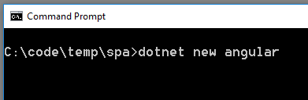
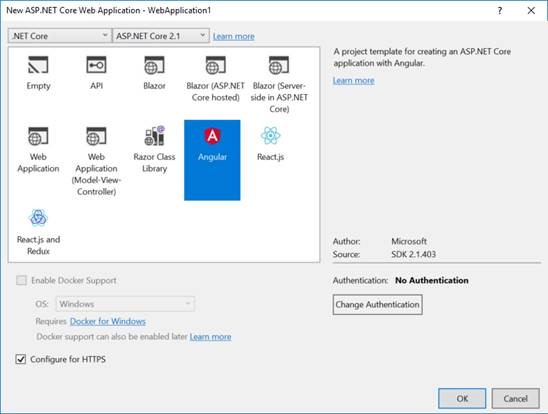
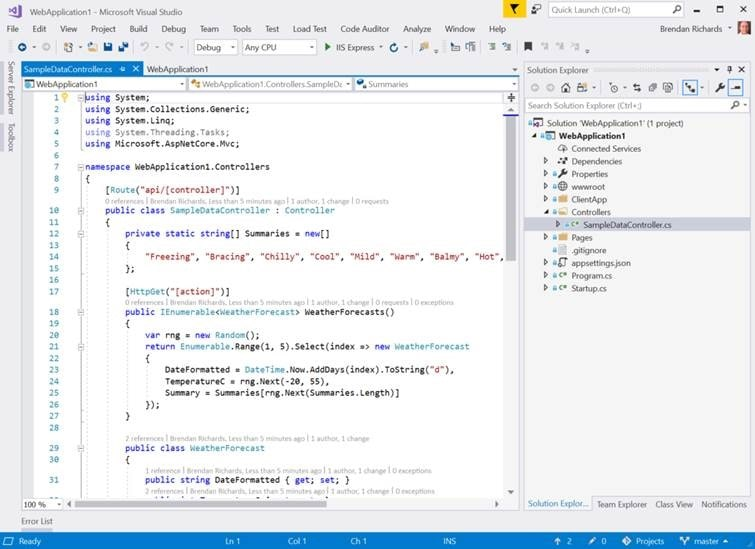
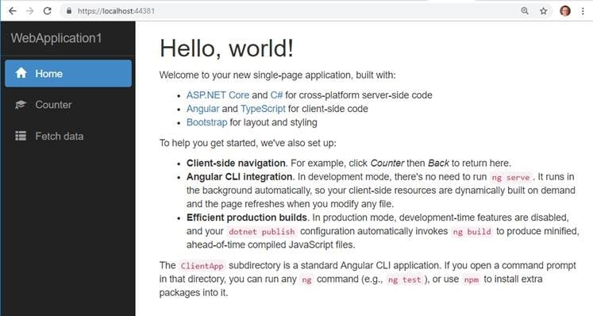
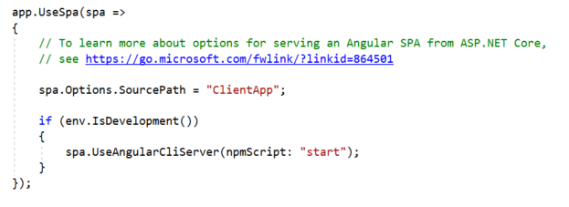

<b>​​For .NET Developers only!</b>

For many Angular solutions, a good practice is to keep your client-side and server-side code in separate projects. 
<ul><li>You get a clear separation of concerns</li><li>You usually expect your server-side stack to outlive your client-side technologies</li><li>You may plan to use your WebAPI with multiple user interfaces such as mobile or bots </li><li>Easier to deploy your angular app to a CDN </li></ul>
 <excerpt class='endintro'></excerpt> 

For some solutions, it might be simpler to integrate your client-side and server-side into a single project – and with the SPA templates for ASP.Net Core, this has never been easier.
<ul><li>A single project might make sense for a smaller, simpler solution </li><li>There will be only one website to deploy to a single web server that will serve both angular and WebAPI sites </li><li>The project can be built with a single build process </li><li>This might be a good choice if you are looking to migrate an existing MVC website as you can host MVC pages and the Angular app under one site </li><li>This approach is easier if you want to use Windows Authentication </li><li>No CORS configuration required </li></ul>
To create an Angular application with the SPA template new project from the command line or you can use Visual Studio. From ASP.NET Core 2.1 onwards, this template is included.  
<dl class="image"><dt></dt><dd>Figure: Creating a project from the command line</dd></dl><dl class="image"><dt></dt><dd>Figure: Creating a project using Visual Studio  </dd></dl>
Although Visual Studio can be used to create the project, we still recommend Visual Studio Code for working with the Angular code, as per <a href=/how-to-get-your-machine-setup>Do you know the best IDE for Angular? </a>  
   
<h3 class="ssw15-rteElement-H3">
    ​​​The ASP.NET Core SPA Template for Angular Includes: </h3><dl class="image"><dt></dt><dd>Figure: A simple example WebAPI</dd></dl><dl class="image"><dt></dt><dd>Figure: An Angular UI with Twitter Bootstrap styling</dd></dl><dl class="image"><dt></dt><dd>Figure: Server-side configuration in Startup.cs allowing the Angular UI to be hosted from under the single ASP.NET Core website</dd></dl>
This Angular app uses the Angular CLI and is fully compatible with any other Angular CLI app. If you want to create a new app from scratch, simply delete the contents of the <strong>ClientApp</strong> folder and run <strong>ng new.</strong> 

So you get the benefits of easy client-server integration without having to compromise any Angular client-side features or Angular CLI tooling. 

