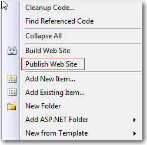

In ASP.NET deployment is a simple xcopy. Or you can right click the website project and  "Publish website" in Visual Studio.

::: good  
  
:::

<!--endintro-->

In SharePoint the way to deploy a set of changes is via a solution package.

SharePoint provides additional layer and infrastructure on top of ASP.NET - part of this layer is the support for administrators (who may not be developers) to quickly add, remove, activate and deactivate features across a SharePoint site farm.

These are awesome features and something that basic ASP.NET does not have, but it does add additional development overhead to build the solution packaging.

1. You need to create such a package via VSeWSS (or a similar tool such as WSP Builder)
2. Add entries for all the files you want to include in the package
3. Update and get the latest version of the files from development SharePoint or TFS
4. Compile the package into a WSP file (which is a cab file)
5. Test the package on a staging server
6. Deploy it on a production server
