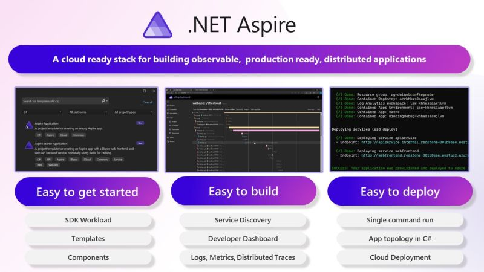

Building cloud-native applications can be challenging due to their complexity and the need for scalability, resilience, and manageability.
There are lots of ways to build cloud-native applications and the overwhelming number of choices can make it difficult to know where to start.


Also, the complexity of modern cloud-native applications can make them difficult to manage and maintain.

.NET Aspire is a powerful set of tools, templates, and integrations designed to streamline cloud-native app development with .NET. It offers a consistent approach to orchestration, standardized integrations, and developer-friendly tooling to help you build robust, production-ready applications.

`youtube: https://www.youtube.com/watch?v=59G9Cd-rV9w`  
**Video: Cloud Native Aspirations with .NET Aspire | Matt Wicks & Rob Pearson | SSW User Groups (1:28 hr)**

<!--endintro-->



.NET Aspire addresses common pain points in cloud-native development:

#### Orchestration

.NET Aspire helps you manage interconnected services and resources in your application by:

* Automatically setting up service discovery and environment variables.
* Providing tools to spin up local containers and configure dependencies.
* Simplifying complex setups with clear abstractions, reducing the need for low-level configuration.

#### Integrations

.NET Aspire integrations make it easy to connect to essential services:

* NuGet packages like `AddRedis` or `AddAzureServiceBusClient` streamline configuration and health checks.
* Standardized interfaces reduce boilerplate code and ensure seamless connectivity.

#### Tooling and Templates

Leverage predefined templates and tooling to:

* Generate projects with common configurations like health checks and telemetry.
* Save time with opinionated defaults for service discovery, logging, and monitoring.
* Kickstart new projects or integrate Aspire into existing .NET apps.

## Example - Adding Redis Cache to a .NET Core app

### The old way

1. Manually set up a Redis container (e.g., using Docker Compose).
2. Write custom code to handle connection strings and inject them into your application.

```csharp
var redisConnection = Environment.GetEnvironmentVariable("REDIS_CONNECTION_STRING") ?? "localhost:6379";
services.AddStackExchangeRedisCache(options =>
{
    options.Configuration = redisConnection;
    options.InstanceName = "SampleInstance";
});
```

::: bad  
Figure: Bad Example - Manually setting up Redis cache 🥱
:::

### The new way - with .NET Aspire

Aspire handles Redis setup and connection string injection for you:

```csharp
var builder = DistributedApplication.CreateBuilder(args);
var cache = builder.AddRedis("cache");
builder.AddProject<Projects.MyApp>("app")
       .WithReference(cache)
       .WaitFor(cache);
```

::: good
**Figure: Good Example - Simple Redis setup with .NET Aspire 🚀**
:::

No need to write Docker Compose files.
Connection string is automatically injected.

## Get Started with Aspire

Check out Microsoft's docs  
<https://learn.microsoft.com/en-us/dotnet/aspire/get-started/aspire-overview>

::: greybox  
You can test out Aspire by running the SSW.CleanArchitecture template - Let us know what you think!  
https://github.com/SSWConsulting/SSW.CleanArchitecture?tab=readme-ov-file#installing-the-template  
:::
