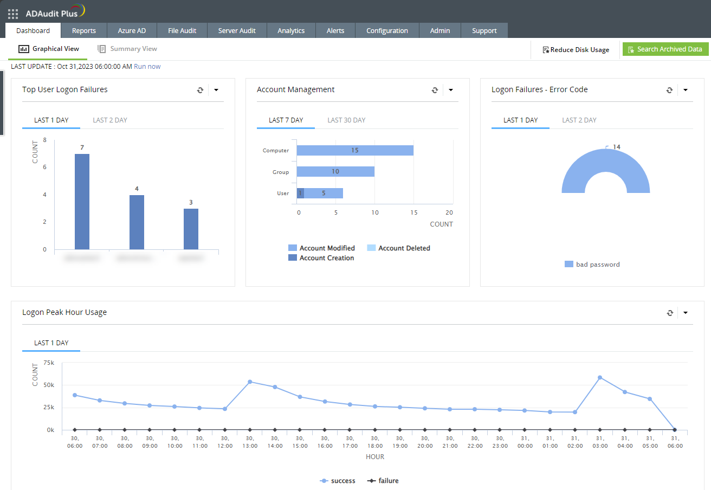
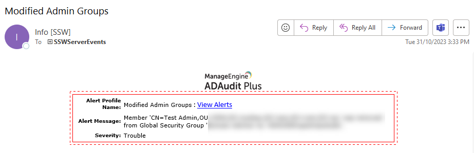

Keeping your Active Directory (AD) environment secure is paramount for your overall security posture, so it is important to keep track of changes that are made in AD - and to have alerts for when potentially damaging changes are made.

Auditing your Active Directory environment with third-party tools offers several advantages. While this can be done with a SIEM such as [Splunk](https://www.splunk.com/) or [Microsoft Sentinel](https://azure.microsoft.com/en-au/products/microsoft-sentinel), these might be overkill for some companies. 

There are dedicated tools just for AD Auditing, such as [ManageEngine ADAudit Plus](https://www.manageengine.com/products/active-directory-audit/). Let’s delve into the benefits of using such tools, focusing on visibility, alerting, and reporting:

<!--endintro-->

## **1. Enhanced Visibility:**

Third-party AD auditing tools provide deeper insights into your environment. They allow you to track changes, monitor user activity, and understand permissions more comprehensively. Here’s how enhanced visibility benefits your organization:

* **Granular Tracking**: These tools capture detailed information about user logon/logoff activity, group membership changes, and modifications to AD objects. You gain visibility into who did what and when.
* **Real-Time Monitoring**: With real-time monitoring, you can detect suspicious or unauthorized activities promptly. Whether it’s an unexpected privilege escalation or an unusual login pattern, these tools keep you informed.
* **Identifying Stale Accounts**: By identifying inactive or stale accounts, you can improve security and reduce clutter in your AD environment.

## **2. Proactive Alerting:**

Effective alerting mechanisms are crucial for timely incident response. Third-party AD auditing tools offer customizable alerts based on specific events or conditions:

* **Threshold Alerts**: Set thresholds for critical events (e.g., failed logins, privilege changes). When these thresholds are exceeded, receive alerts via email or other channels.
* **Privileged Group Changes**: Get notified when users are added to or removed from privileged groups (e.g., Domain Admins). This helps prevent unauthorized access.
* **Suspicious Behavior**: Receive alerts for unusual patterns, such as multiple failed logins or access from unexpected locations.

## **3. Comprehensive Reporting:**

Reporting is essential for compliance, audits, and management decision-making. Third-party tools provide pre-built reports and customizable templates:

* **Change Reports**: Track modifications to AD objects (users, groups, OUs) over time. Examples include user creation/deletion, password changes, and group membership updates.
* **Security Reports**: Assess security settings across your AD environment. Identify vulnerabilities like weak passwords or excessive permissions.
* **Compliance Reports**: Generate reports aligned with industry standards (e.g., PCI DSS, HIPAA). Demonstrate adherence to regulations.

## **Examples of Third-Party Tools:**

Here are some notable third-party AD auditing solutions:

1. **ManageEngine ADAudit Plus**:

   * Offers comprehensive auditing capabilities for AD.
   * Tracks changes in real-time.
   * Provides pre-built reports and customizable dashboards.
   * [URL: ManageEngine ADAudit Plus](https://www.manageengine.com/products/active-directory-audit/)
2. **SolarWinds Access Rights Manager**:

   * Covers compliance audits and permission auditing.
   * Enhances AD management with time-saving features.
   * [URL: SolarWinds Access Rights Manager](https://www.solarwinds.com/access-rights-manager/use-cases/active-directory-auditing-tool)
3. **Netwrix Auditor**:

   * Offers change management features.
   * Provides detailed reports on AD changes.
   * [URL: Netwrix Auditor](https://www.netwrix.com/auditor.html)

Remember that the choice of tool depends on your organization’s specific needs, budget constraints, and scalability requirements. Evaluate different options to find the best fit for your environment!