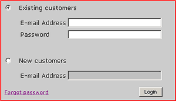
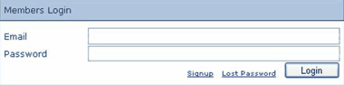

For a web site that expects a lot of first-time visitors, it is wise to put the                     user registration form on the same page as the sign in dialog. This saves having the                     user click on another link to enter their details.

<!--endintro-->
<dl class="badImage">&lt;dt&gt; 
      
   &lt;/dt&gt;<dd> Figure: Bad example - non-friendly sign in screen</dd></dl>
The image is a bad example of a dialog box because:

* You can easily enter the correct data and click the wrong hyperlink (i.e. Join or sign in)
* By well-established convention, buttons should be used whenever form data is to be submitted back to the server
* The "Forgot my Password" link is ambiguous - Does it take me to a new page or do I have to enter the email address field first?
* A button, not a link, should be used for submitting data, as links don't allow the user to hit "enter"

<dl class="goodImage">&lt;dt&gt; 
      
   &lt;/dt&gt;<dd> Figure: Good example - friendly sign in screen for many new visitors</dd></dl>
For a web site that expects few first-time visitors, this is a good sign in screen, as it is clean and concise:
<dl class="goodImage">&lt;dt&gt;
                        &lt;/dt&gt;<dd>
                        Figure: Good example - friendly sign in screen for few new visitors</dd></dl>
**Note:** Generally, the action buttons should be aligned to the right.
