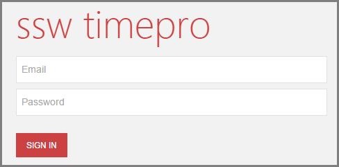
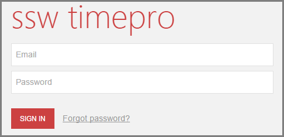
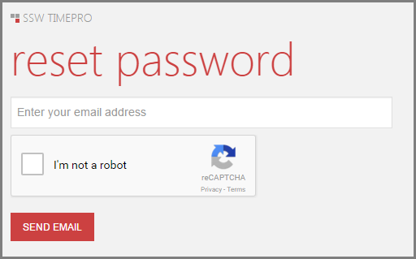
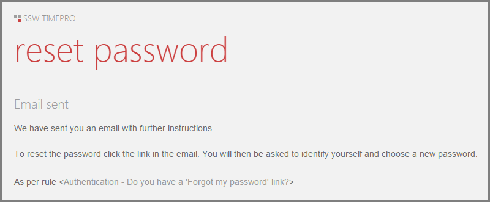

It's easy and common for users to forget their passwords, the vital key which grants them access to the services they are eligible for.
To cater for this instance, it is important to have a 'Forgot my password' link on the sign in page.

<!--endintro-->

::: bad  
  
:::

::: good  
  
:::

::: good  
  
:::

### Do you avoid a username enumeration attack?

This practice also opens up the risk of "username enumeration" where an entire collection of usernames or email addresses can be validated for existence on the website simply by batching requests and looking at the responses.
You can read more on [Troy Hunt's blog post](http://www.troyhunt.com/2012/05/everything-you-ever-wanted-to-know.html).
You should always aim to not disclose if a user is registered with your site or not.

::: bad  
  
:::

::: good  
  
:::
