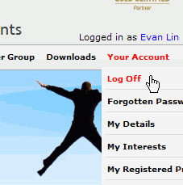

Although most of the sites have a 'Log off' submenu, we recommend adding a short                     cut next to the username, this will make the 'log Off' operation more convenient.

<!--endintro-->

::: bad  
  
:::

::: good  
  
:::
