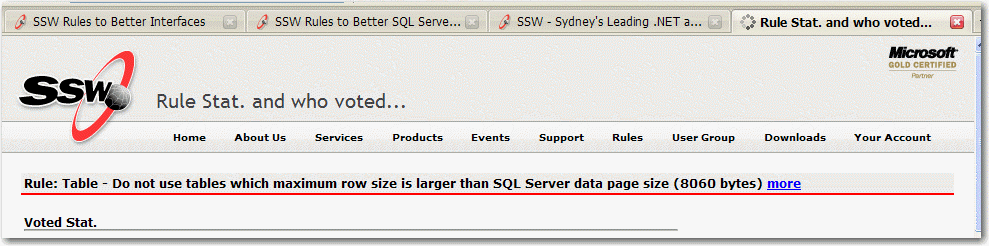
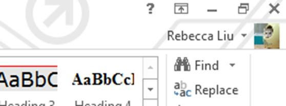

Remember to make the "logged in" state clear enough to help the user know the current state.

<!--endintro-->

::: bad  
  
:::

::: good  
  
:::

::: bad  
  
:::

::: good  
  
:::

::: good  
  
:::

::: good
Figure: Good Example – Metro UI’s new logged in state     

:::
