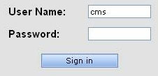
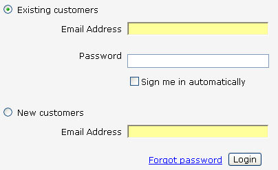

It is easier for users to remember their frequently accessed email address more so than one of their many usernames. For this reason, it is best to use email address instead of username for the sign in page.

<!--endintro-->

"I do recommend letting users enter their email address instead of a user ID: It's guaranteed to be unique and it is easy to remember."

**Jakob Nielsen** ,  Ph.D. and Principal at Nielsen Norman Group

::: bad  
  
:::

::: good  
  
:::
