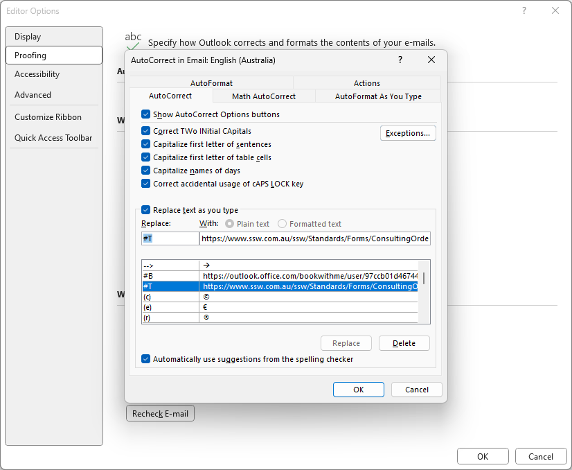

You just received another email from a client asking for your company's Terms and Conditions. Instead of navigating through your files or searching your website to find the link, wouldn't it be more efficient to simply type a shorthand code like `#`+ `T` and have Outlook automatically insert the URL for you?

This is where the Autocorrect feature in Outlook can become a huge time-saver.

<!--endintro-->

## Why Use Autocorrect for URLs?

* **Efficiency**: It saves time by eliminating the need to find and copy-paste URLs
* **Consistency**: It ensures that everyone is using the same URL and reduces the risk of errors
  
## How to Set It Up

1. Open Outlook and go to **File | Options | Mail | Spelling and Autocorrect**  
2. Click `Autocorrect Options` and add your shorthand and URL link.

::: greybox

# T - Adds a link to the company’s Terms and conditions. E.g. <https://www.ssw.com.au/terms-and-conditions>

# B - Adds a link to your [Bookings](https://www.ssw.com.au/rules/meeting-bookings)

:::

::: good
Figure: Good example - Using shorthand codes to represent commonly used URLs
:::

By using Autocorrect in Outlook effectively, you can speed up your workflow. It's a small change with a big impact. Make sure to choose shorthand that is both unique and easy to remember.
