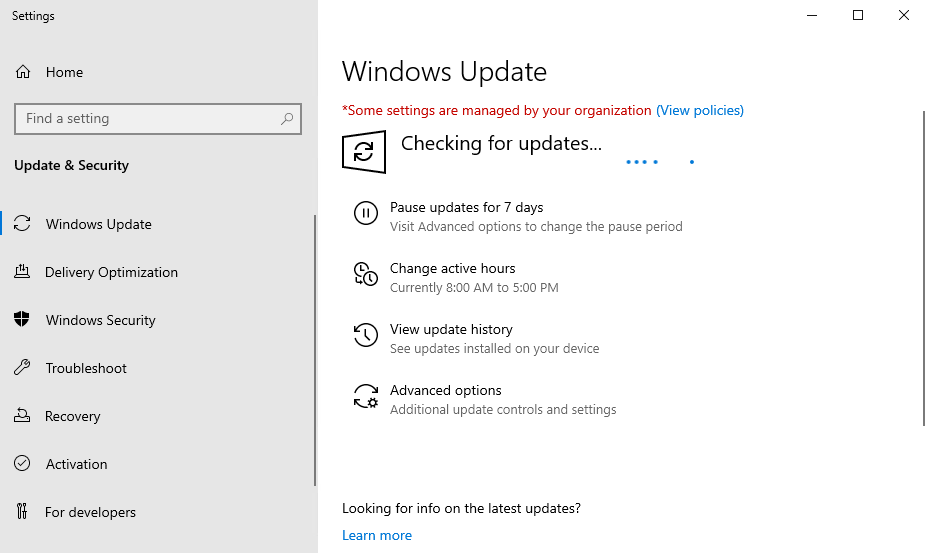
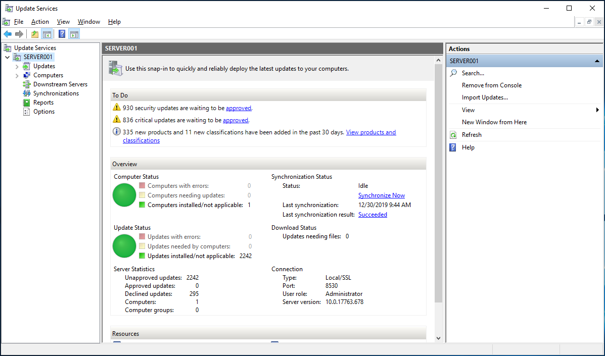
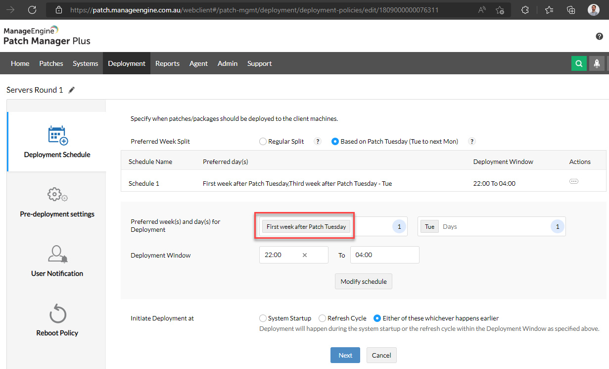
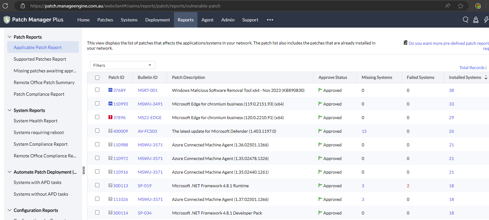

To keep your systems secure, it is important to make sure everything is kept up to date - the OS, and any installed apps.

<!--endintro-->

Updating everything manually is time consuming, and it can be easy to miss patches without an automated system.

::: bad

:::

[WSUS ](https://docs.microsoft.com/en-us/windows-server/administration/windows-server-update-services/get-started/windows-server-update-services-wsus)is a great way to keep Microsoft operating systems and products up to date. It can be painful to manage, but with a bit of work it is a great tool. The only issue is that it cannot be used to manage any non-Microsoft apps. If your environment is big enough, you can use [Configuration Manager](https://docs.microsoft.com/en-us/mem/configmgr/core/understand/introduction) (formerly SCCM) for 3rd party apps - but it is not worth setting up for smaller environments.

:::ok

:::

This is where other Patch Management solutions come in. There are many options out there, including:

* [ManageEngine Patch Manager Plus](https://www.manageengine.com.au/patch-management/) **\- RECOMMENDED**

  * Good, transparent [pricing $$](https://www.manageengine.com/patch-management/pricing.html)
  * Long list of [supported applications](https://www.manageengine.com/patch-management/supported-applications.html)
* [Automox](https://www.automox.com/)

  * More expensive $$
* [Action1](https://www.action1.com/)

  * Good pricing $$
  * Needs more supported applications

These products have varied pricing options, including some free options with limitations on the number of devices and/or users. These solutions could be used alongside WSUS, but they do support Microsoft updates as well as 3rd party apps - so they can replace WSUS altogether.

The main benefits of patch management solutions are:

* Automatic installation of Windows updates (with or without rebooting)
* Automatic installation of third-party updates
* Manual deployment of patches without RDP access to the computer/s
* Reporting - lots of information about installed or missing patches, and vulnerability levels

You should consider when to automatically install updates - of course, it needs to be a time that will cause minimal disruption, but it should also be a suitable amount of time after the updates are released in case there are any issues. Microsoft updates are released on the 2nd Tuesday of every month - known as Patch Tuesday - so you might choose to install the updates a week or two after this date.

:::good

:::

These patch management solutions also include a bunch of other useful features, such as the ability to deploy scripts or configure settings remotely.