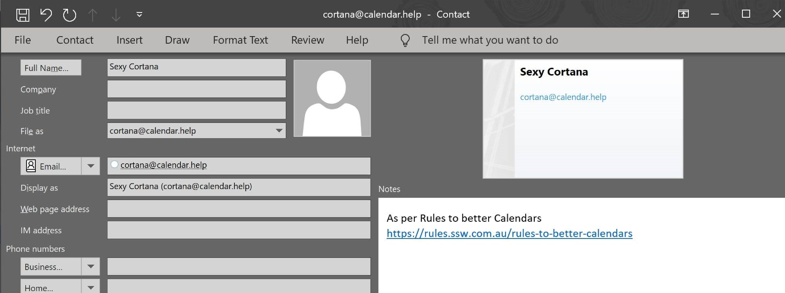
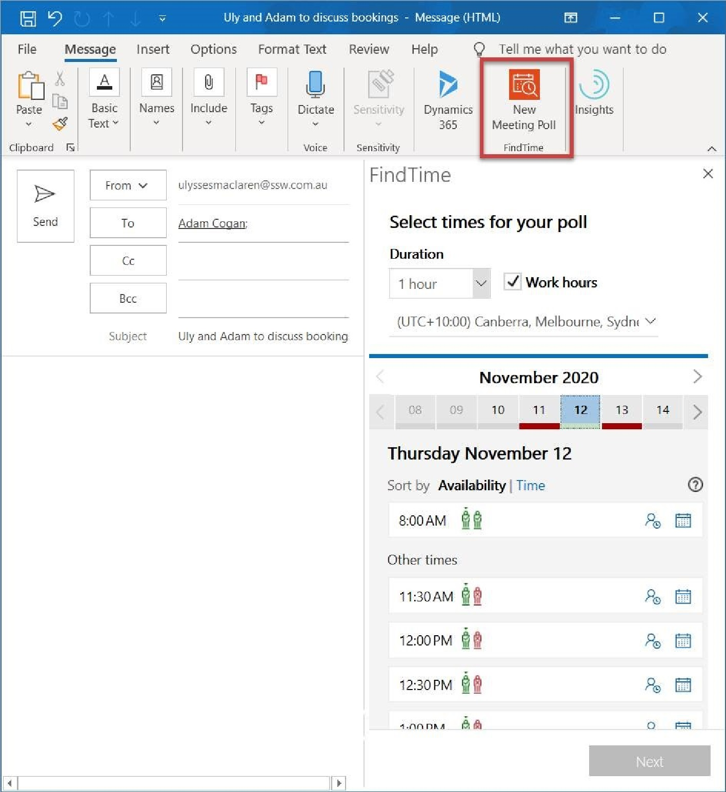

We've all been part of that email chain... "Let's meet to discuss this", "When are you free?", "I can do Friday", "Friday's no good, what about ​Monday?", "I'm free in the morning", "Penny can't make that, how about Tuesday afternoon after 3?", etc. 

 
​AI can make scheduling meetings with multiple attendees much easier.​  
 Note that both of the following solutions work best when you're dealing with people in your own organization, as they then have access to all calendar data, but with a bit of back and forth, they can still work for externals too. 

 <excerpt class='endintro'></excerpt> 
<h3 class="ssw15-rteElement-H3">​Microsoft Cortana Scheduler (formerly known as Calendar.help) </h3><dl class="ssw15-rteElement-ImageArea"> 
    
</dl>
​ This option is best if you're ok to meet any time that your calendar says is free. 

 
   <strong>Instructions to use Cortana:</strong> <strong>Step 1:</strong> Register yourself at 
   <a href="https://calendar.help/">https://calendar.help/</a> before you can use this feature.<strong> </strong>

 
   <strong>Step 2:</strong> Open an email... not an appointment!

To:      [person] Cc:      Cortana@calendar.help Body:  after your normal text to a person, add some extra text like "Cortana, schedule a meeting." 

​Cortana then handles all the back-and-forth emails to find a time when everyone can meet and then she sends out an invite on your behalf. 

 
   <strong>More help for Cortana:</strong> 1. More on 
   <a href="https://calendar.help/">https://calendar.help/</a> and see the FAQ 2. Watch the video here 
   <a href="https://www.microsoft.com/en-us/scheduler">https://www.microsoft.com/en-us/scheduler</a> ​ 
<dl class="goodImage"><dt>
      
   </dt><dd>Figure: Speak to Cortana as you would a PA</dd></dl><dl class="goodImage"><dt>
      
   </dt><dd>Figure: ​​​Corta​​​na will find a time that suits everyone and send the appointment​</dd></dl>
 
   <strong>Step 3:</strong> To make it easier to add Cortana to your emails, create a Contact.
<dl class="image"><dt> 
      ​</dt><dd>Figure: Cortana added as a contact​ </dd></dl>

   <b>Mobile – works great ✔​</b> 
<dl class="image"><dt> 
       
   </dt><dd>Figure: Microsoft Scheduler – Fully works on mobile phone​ </dd></dl><h3 class="ssw15-rteElement-H3">​FindTi​me </h3>
This option is best if you want to be selective about a few ​options for when to meet, and send a poll to attendees to choose. 

FindTime shows what days and times work the best for you and the attendees when available using free/busy data.

Propose your selected times to all attendees and allow everyone to vote and quickly come to a consensus... and you’re done!

FindTime sends out the meeting invite on your behalf. More on <a href="https://findtime.microsoft.com/">https://findtime.microsoft.com</a> 
<dl class="image"><dt> 
       
   </dt><dd>Figure: FindTime gives a nice UI for people working in the same org, as you can see times that might be available for all attendees easily (e.g. 8 am above)​ </dd></dl>

   <b>Mobile – does not work ❌</b>

As of Dec 2020, FindTime does not work on iOS.

Vote at 
   <a href="https://findtime.uservoice.com/forums/316122-ideas-tell-us-your-great-ideas/suggestions/13358103-findtime-for-iphone-in-outlook-for-ios">What features would you like to see in FindTime?</a>

   <b>Note: </b>Findtime’s competitor is https://calendly.com 
<dl class="image"><dt></dt><dd>Figure: FindTime - No mobile support for iOS</dd></dl>

