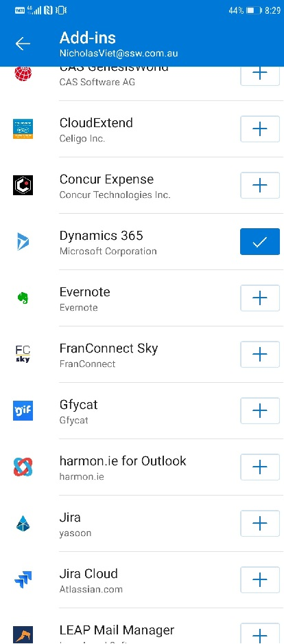

We've all been part of that email chain... _"Let's meet to discuss this"_, _"When are you free?"_, _"I can do Friday"_, _"Friday's no good, what about Monday?"_, _"I'm free in the morning"_, _"Penny can't make that, how about Tuesday afternoon after 3?"_, etc.

AI can make scheduling meetings with multiple attendees much easier. 

Note that both of the following solutions work best when you're dealing with people in your own organization, as they then have access to all calendar data, but with a bit of back and forth, they can still work for externals too. There are some options.

<!--endintro-->

## Microsoft Cortana Scheduler (formerly known as Calendar.help)

This option is best if you're ok to meet any time that your calendar says is free.

**Note:** The helpful tool Scheduler has a portal too at [https://calendar.help/user/dashboard](https://calendar.help/user/dashboard)

### Instructions to use Cortana

#### Step 1 - Register
Register yourself at [Meet Scheduler](https://calendar.help/) before you can use this feature.

#### Step 2 - Send an email
Open an email... not an appointment!

::: email-template  
|          |     |
| -------- | --- |
| To:      | Adam |
| Cc:      | Cortana@calendar.help |
| Subject: | Talk about Northwind project |  
::: email-content  

### Hi Adam,  

We need to talk about Northwind project.

--

<mark>Cortana, schedule a meeting.</mark>

:::  
:::  
**Figure: after your message, add some request to Cortana as you would a PA**

Cortana then handles all the back-and-forth emails to find a time when everyone can meet and then she sends out an invite on your behalf. 

  

::: greybox
**More help for Cortana:** 
1. [FAQ on calendar.help](https://calendar.help/faq)
2. Watch the video here [https://www.microsoft.com/en-us/scheduler](https://www.microsoft.com/en-us/scheduler)
:::

#### Step 3 - Add Cortana as a contact
To make it easier to add Cortana to your emails, create a Contact.

  

**Mobile – works great ✔**

  

## FindTime

This option is best if you want to be selective about a few options for when to meet, and send a poll to attendees to choose.

FindTime shows what days and times work the best for you and the attendees when available using free/busy data.

Propose your selected times to all attendees and allow everyone to vote and quickly come to a consensus... and you’re done!

FindTime sends out the meeting invite on your behalf. More on [https://findtime.microsoft.com](https://findtime.microsoft.com/)

**Note:** Findtime’s competitor is https://calendly.com

  

::: greybox
**Mobile – does not work ❌**   
As of Dec 2020, FindTime does not work on iOS.

:::