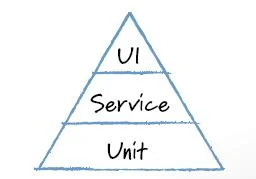

Watching an automated UI test doing its thing can be very compelling. Combining this with the availability (and powerful marketing) of so many automated UI testing frameworks & tools often leads teams to focus too heavily on automating their testing at the UI level.

This is a classic illustration of [the law of the instrument or Maslow's hammer](https://en.wikipedia.org/wiki/Law_of_the_instrument), a cognitive bias that involves an over-reliance on a familiar tool. Abraham Maslow wrote in 1966, *"If the only tool you have is a hammer, it is tempting to treat everything as if it were a nail"*.

While automated UI testing has its place in an overall test strategy (involving both humans and automation), you need to exercise care about how much of your testing is performed at this level.

<!--endintro-->

It's worth looking at Mike Cohn's automated test pyramid:

The topmost layer of the pyramid is deliberately small and represents the relatively small amount of end-to-end UI-based automated checks that should be written and executed against the system. 

✅ **Customer workflows** - Tests at the level of the UI most closely mimic user interaction with the software and so are ideal for checking that the most important customer workflows continue to function as expected 

❌ **Slow to execute** - Testing at this level offers the slowest feedback, since interacting with the user interface is necessarily slower than interacting with smaller units of code within the system

❌ **Slow to write** - Tests at the UI level are broad in scope and generally slower to write than tests at lower levels

❌ **Fragile** - These tests are vulnerable to changes in the software's user interface and so are generally much less reliable than tests at lower levels (e.g. unit and service/API tests)

❌ **Less deterministic** - The scope of automated UI tests is large, so when they fail, they generally don't pinpoint problems in the code as closely as, say, unit or API tests

❌ **Hard to test business logic** - There is always back-end functionality and business logic that is incredibly hard to "reach" via the user interface and internal infrastructure is nearly impossible to exercise/test via automation at this level 

::: greybox
Focusing automated UI testing on important user workflows in your system can be of great benefit. But choose your tests at this high level very carefully and consider using higher value, lower cost alternative types of test lower down the pyramid for the majority of your automated testing.

You can read more about best practices for automated UI testing at [Do you do automated UI testing?](/automated-ui-testing)
:::
