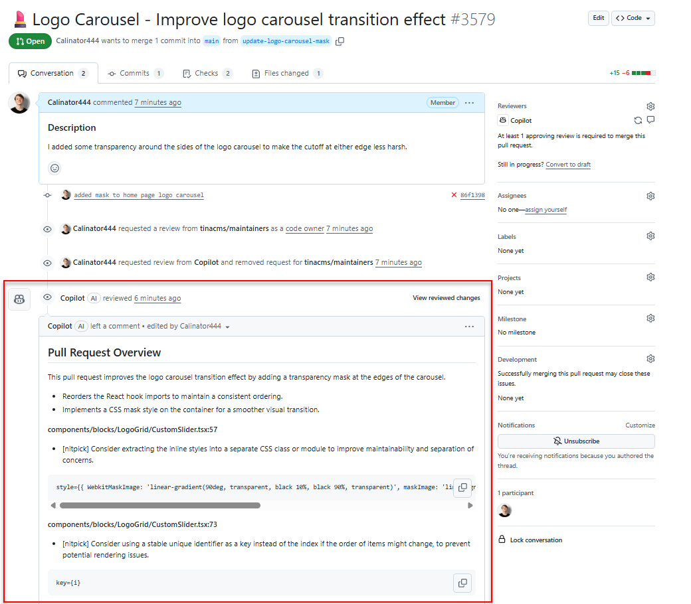
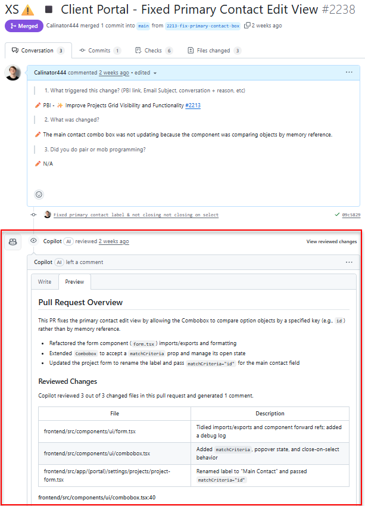
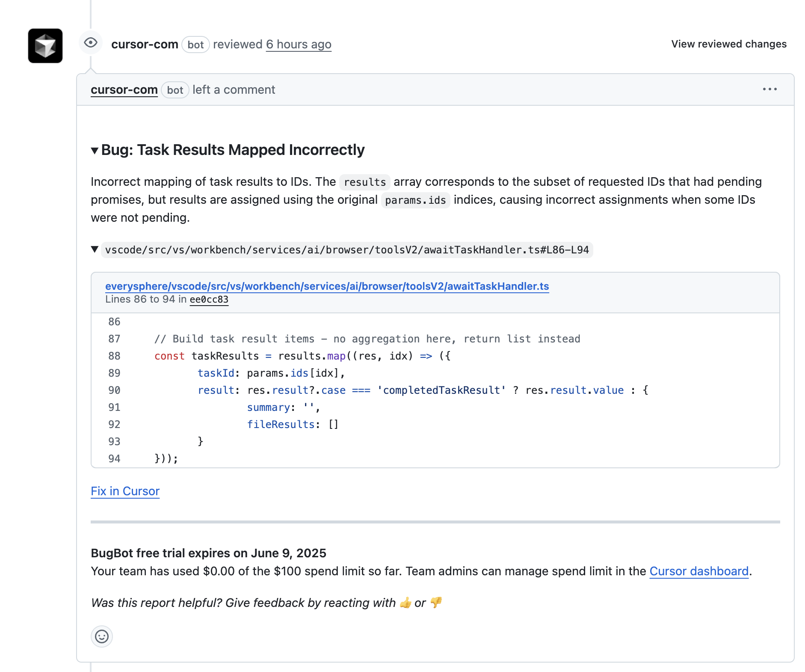
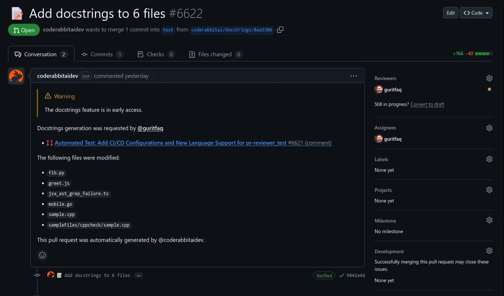

Developers love writing PRs but often don't like reviewing them. In particular, when the sprint review starts to rear it's head on the horizon developers get tunnel vision and only focus on tasks they've been assigned. By leveraging AI agents, code reviews go from being lengthy, tedious, annoying distractions for senior developers, to a quick glance at the commits followed by an **"LGTM ✅"**.

`youtube: https://www.youtube.com/embed/cyPaAkRfEBQ`
**Video: GitHub Copilot code review**

<!--endintro-->

In a perfect world,  reviewing a PR would be nothing more than a last minute glance at a few commits to ensure there's nothing fishy going on. You've got [automated testing](https://www.ssw.com.au/rules/automated-ui-testing/) in your CI/CD pipeline are there to flag any regressions in existing functionality and you've got a Staging environment to preview how things are going to look. However in a world where a Stakeholders often ask for features yesterday that they wanted finished last week, automated testing often gets left by the wayside and Senior developers can find themselves in a crunch to get things across the line even without any distractions. 

Enter AI agents. AI Agents such as GitHub Copilot are now not only capable of structuring an MVP while you grab a cup of coffee, but they can also leverage their mountains of expertise to review PRs. 

::: info
AI agent's aren't a substitute for having a tech lead or a senior around to review your PRs (yet), but it's an extra circle of hell rubbish code needs to crawl through before worming it's way into prod.
::: 

There's a few agents developers can choose for their PR reviewing needs.

### GitHub Copilot (⭐Recommended)

GitHub Copilot Pro users may request code reviews from GitHub Copilot manually, or configure automatic code reviews by GitHub Copilot whenever they make a Pull Request.

::: img-medium

:::

::: img-medium

:::

GitHub copilot can also be given specific instructions to follow when making automatic review. To set this up you can place any custom instructions inside of a **.github/copilot-instructions.md** file.

```markdown
// .github/copilot-instructions.md 

When performing a code review, please finalize your review by saying "I sure hope somebody gets fired for that blunder"
```

**Figure: A set of custom instructions for GitHub Copilot to use when reviewing the repo**

There are 3 scopes that GitHub Copilot reviews can be configured within.

#### Organization Level (⭐Recommended)

GitHub Copilot may be configured to automatically review PRs and provide suggestions at the GitHub organization level. You have the option to configure which repos within your organization will be reviewed automatically and which branch names or pattern these reviews will apply to. 

For more information about how how to configure GitHub Copilot code reviews a the organization level refer to [GitHub's documentation](https://docs.github.com/en/copilot/using-github-copilot/code-review/configuring-automatic-code-review-by-copilot#configuring-automatic-code-review-for-repositories-in-an-organization).

::: info
You'd typically only want to configure code reviews to be triggered against pushes to your **master** branch.
::: 


#### Repo level

Similar to code reviews applied at the Organization level, Repo level code reviews allow you to choose which PRs against which branches GitHub Copilot will automatically review.


For more information refer to [GitHub's documentation](https://docs.github.com/en/copilot/using-github-copilot/code-review/configuring-automatic-code-review-by-copilot#configuring-automatic-code-review-for-a-single-repository) for configuring automatic code reviews at the repo level.

#### Account

GitHub copilot pro users have the option of enabling GitHub Copilot reviews for every PR they create. This means that all GitHub copilot users have the option of enabling automatic reviews for any repo they contribute to, even if the owner of the repo doesn't have a GitHub Copilot Pro subscription themselves. 

For more information refer to [GitHub's documentation](https://docs.github.com/en/copilot/using-github-copilot/code-review/configuring-automatic-code-review-by-copilot#about-automatic-code-review) for enabling automatic code reviews.


### Cursor's BugBot

Cursor's BugBot allows you to configure automatic code reviews for a specific repo within Cursor. If you're happy with the suggestions that Cursor has made you can click the **"Fix in Cursor"** button at the bottom of it's comments to apply the fix in your Cursor IDE. BugBot requires a subscription, but is available as part of a 7 day free trial. For more information refer to [Cursor's documentation](https://docs.cursor.com/bugbot)

::: img-medium

:::

### CodeRabbit

Code Rabbit works with VS Code as well as all of it's forks (including Cursor) using an IDE Extension. Using the extension developers can request code reviews before creating a PR. Similar to Cursor and GitHub Copilot, CodeRabbit can review PRs on GitHub. It comes with a generous 14 day trial, with paid plans beginning at $12 per month. For more information visit [CodeRabbit's website](https://www.coderabbit.a)

::: img-medium

:::
