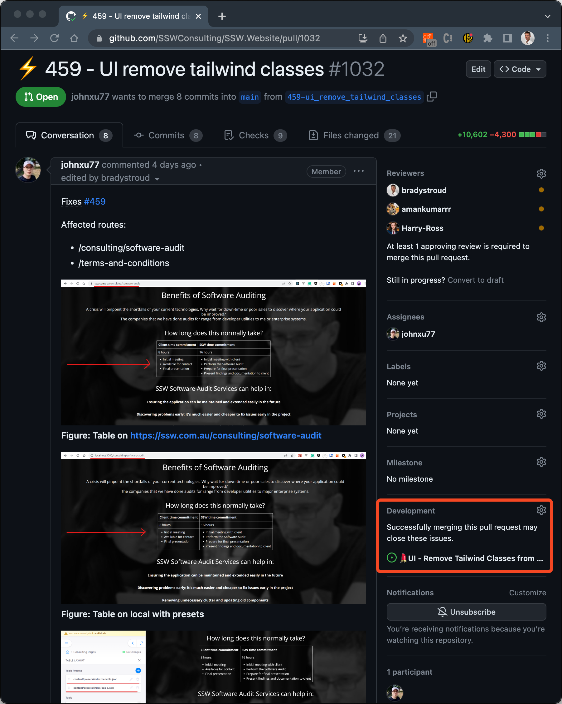

GitHub provides a way to link issues to PRs. This is useful to see what PRs are associated with what issues. However, when you make this link, the issue will close when the PR is merged.

This is not a good idea because it can cause issues to be closed prematurely. This can lead to confusion and lost work.

<!--endintro-->

Issues should not be closed until all the tasks are complete and have a done comment as per [Do you close PBIs with context?](/close-pbis-with-context/)

::: bad

:::

**Tip:** Avoid using closing keywords e.g. _"closes #123"_ or _"fixes #123"_ in PR descriptions. This will automatically link the issue to the PR and close it on PR merge.
Instead, use terms like _"relates to #123"_ or _"addresses #123"_ to link the issue to the PR without closing it.

This was a feature GitHub added but it is not a good idea to use it, if you agree the behaviour should be changed, go upvote this discussion <https://github.com/orgs/community/discussions/17308>
