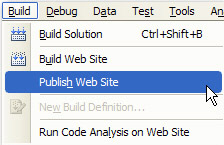
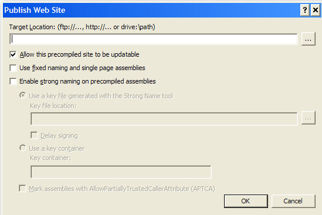
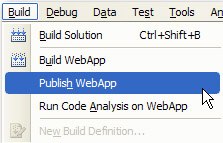
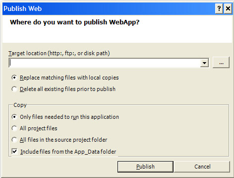

When you are deploying an ASP.NET project (no matter it's a website or a Web application), do not copy all files of this project to the production server because source code will be deployed during this simple copy and it makes easier for others to access or tamper the source code of your site.

Instead, please use 'Publish' utility to deploy your website or Web application. This utility can remove the source code from the site.

<!--endintro-->

### 1. Website Project

**Publish Website** dialog box is designed to precompile and deploy your website to a new location (whatever it is, **ftp://**, **http://** or **drive:\path**). During the deployment, source code are removed automatically. Besides, the precompilation process finds any compilation errors and identifies the errors in the configuration file.j

To access this dialog box, please open a website that you want to deploy and click **Build** menu, then click **Publish Website** .

  

  

See more about [Publishing Websites](https://docs.microsoft.com/en-us/previous-versions/20yh9f1b(v=vs.140)?redirectedfrom=MSDN).

### 2. Web Application Project

The **Publish Web** dialog box enables you to build and publish a Web application project to a new location. Like  **Publish Website** dialog box, this utility can remove source code. However you have to select **Only files needed to run this application** to specify it. Other benefit of this utility is that potential errors and compile-time errors in the Web.config file and in other non-code files can be found.

To access this dialog box, open a Web application project that you want to publish and click **Publish** ApplicationName on the  **Build** menu.

  

  

See more about [How to Publish Web Applications](https://docs.microsoft.com/en-us/previous-versions/aspnet/aa983453(v=vs.100)?redirectedfrom=MSDN).
