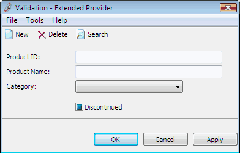
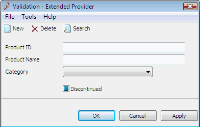

Labels provide an easy way to show text in a form. It is recommended to consistently keep labels as clean as possible, without having them ending a colon [ <b>:</b> ], which is a common thing to do in Windows Forms.​ 
 <excerpt class='endintro'></excerpt> 
<dl class="badImage"><dt>
      ​ </dt><dd>Figure: Bad Example - Labels with ":" at the end</dd></dl><dl class="goodImage"><dt>
       
       
   </dt><dd>Figure: Good Example - Clean labels without ":"</dd></dl>

