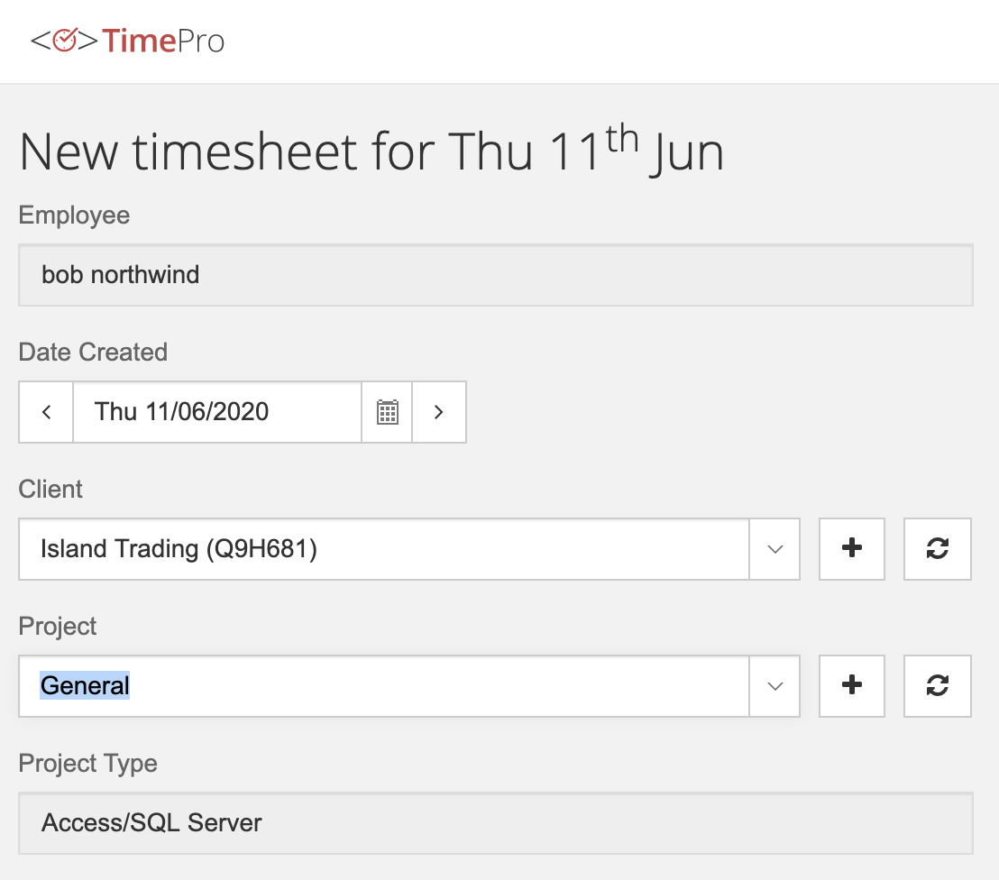
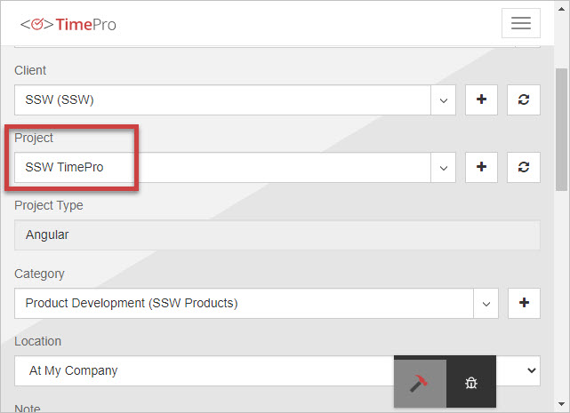

Developers should **avoid** using "General" project in their timesheets.

"General" should only be used in rare cases, when you're doing something that:

* Doesn’t fit in any of the existing projects
* Isn’t worth creating a new project, as it won’t be a long term project or repeated in the future

<!--endintro-->

If you’re using "General" in timesheets frequently, then it’s a problem.

::: bad  
  
:::

::: good
  
:::
