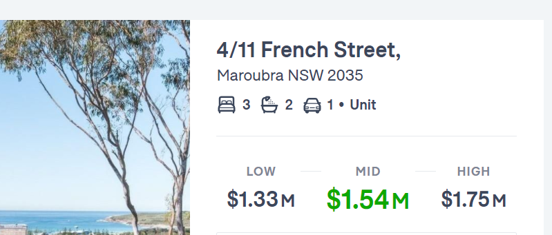

Thinking about UI, we want to make them as clean as possible...and you do that by removing noise. One of the most common ways to remove noise is to remove or de-emphasise labels.

<!--endintro-->

Learn more on [Labels are a last resort](https://www.refactoringui.com/previews/labels-are-a-last-resort).

