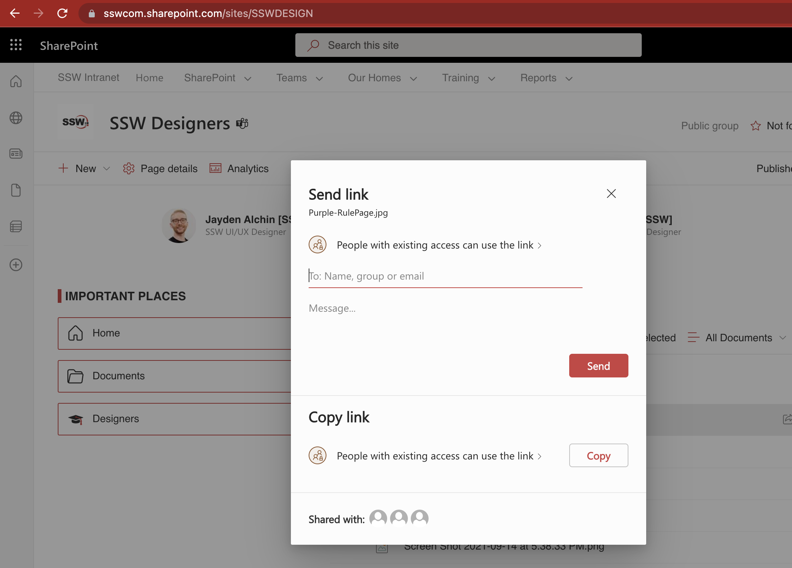

Using screen captures is a good practice - pictures do tell a thousand words - but don't include unnecessarily huge images or attachments in your email. 

When your attachment is too big, you should think twice.

<!--endintro-->

Avoid large attachments. If you are sending an email with attachments or images that are **greater than 1MB** you need to consider:

* Files - Could a URL be better than this attachment?
  - Could I send this as a UNC to an internal share?
* Images - Could I put this picture on Google Photos or another image server?

::: email-template  
|          |     |
| -------- | --- |
| To:      | Bob Northwind |
| Attached:      | filename.png (2.5MB) |
| Subject: | Northwind app - New artwork |  
::: email-content  

### Dear Bob,

Thank you for spending time with us to come to a better understanding of your business requirements. Please review the new version of the artwork attached

Regards, 
Dave

:::  
:::  
::: bad
Figure: Bad example - Sending a large attachment
:::

::: email-template  
|          |     |
| -------- | --- |
| To:      | Bob Northwind |
| Subject: | Northwind app - New artwork |  
::: email-content  

### Dear Bob,

Thank you for spending time with us to come to a better understanding of your business requirements. Please review the new version of the artwork at [filename.png](https://northwind365.com/images/Group%2013.png)

PS: Sending the image as a link as it is too big to attach. 

Regards, 
Dave

:::  
:::  
::: good
Figure: Good example - Sending a link instead of an attachment
:::

::: info
**Note:** An added advantage is that the document stays alive. If the URL has been updated and a user takes a week to get around to this email, they will view the latest version.
:::

### Tips 

1. Reduce the size by sending just the relevant part of the image you need

2. Avoid **.bmp**. Use **.jpg**, **.gif** or **.png** instead

3. If you are sending photos (every year cameras are making our photos bigger and bigger) you may need to [resize them down](https://imagecompressor.com/).

4. If you have multiple files, consider .zip them

5. SharePoint was built with sharing files in mind and is a great way to collaborate. If you are using SharePoint to send a file you simply need to open the context menu, click "send to" and "email a link" as shown: 

  

### When can you break these size rules?

Basically, you should be practical:

1. There is no other way under particular circumstances
2. To keep the history if the file is already part of the thread
