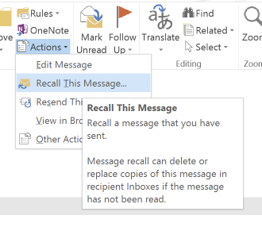
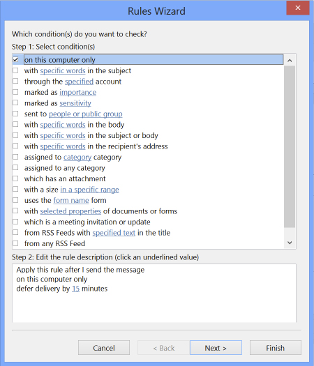

Occasionally you will send an email and want to make changes to it after it's already gone. Microsoft Outlook has the option to "recall the message" but this is not recommended mainly because you cannot guarantee the recipient hasn't seen the message already.

What you need to do is to set a rule to delay sending your emails in 15 minutes for example, which gives you time enough to correct it in most of the cases. If you only realize your mistake after this amount of time, just use "reply to all" mentioning your changes.

<!--endintro-->

Here is how you do it in Outlook :

1. Click the  **File** tab.
2. Click  **Manage Rules & Alerts** .
3. Click  **New Rule** .
4. In the Step 1: Select a template box, under Start from a Blank Rule, click  **Apply rule on messages I send** , and then click  **Next** .
5. In the Step 1: Select condition(s) list, select the check boxes for any options that you want, and then click  **Next** .
    When you don't select any check boxes, a confirmation dialog box appears to confirm that the rule you are creating will be applied to all messages that you send.
6. In the Step 1: Select action(s) list, select the "defer delivery by a number of minutes" check box.
7. In the Step 2: Edit the rule description (click an underlined value) box by entering the number of minutes you want the messages to be held before it is sent. Delivery can be delayed up to 120 minutes.
8. Click  **OK** , and then click  **Next** .
9. Select the check boxes for any exceptions that you want. Click  **Next** .
10. In the Step 1: Specify a name for this rule box, type a name for the rule (E.g. "Delay sending emails").
11. Select the Turn on this rule check box.
12. Click Finish.

Now when you click Send, each message remains in the Outbox folder for the time that you specified and you can make changes to it until then.

::: bad  
  
:::

::: good  
  
:::
