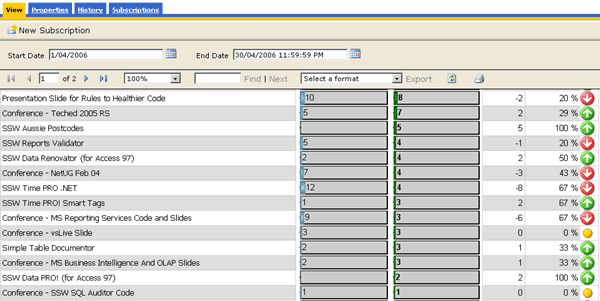
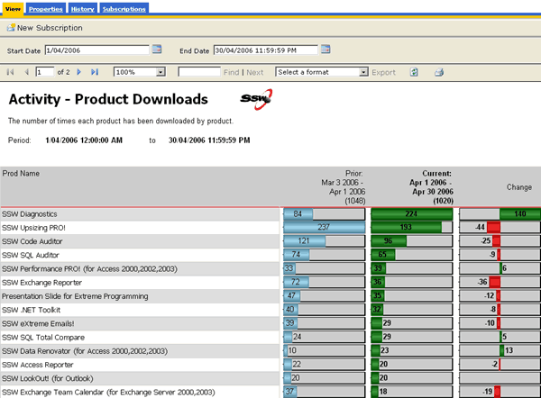

When comparing two sets of data in a report (for example, sales this month compared to last), showing the change as a percentage is a bad idea.

<!--endintro-->

For example, if you made 1 sale last month and 2 this month, you have had a 100% increase. If for another product you made 1000 sales last month and 2000 this month, that is also a 100% increase, but you've sold 1000 of that product compared to 1 of the other product.

For this reason, show the difference as an actual value, so you can compare all values easily. See the figures below for examples. To see how to create the negative/positive valued chart, see [Do you use expressions to show the correct scale on charts?](https://www.ssw.com.au/ssw/Standards/Rules/RulesToBetterSQLReportingServices.aspx#maxminvalues)

**Bad**   - Notice how the "change" column in the report doesn't accurately reflect the difference in downloads - 1 download last month and 2 downloads this month will yield a 100% increase - which looks impressive as a percentage but really isn't.

::: bad  
  
:::

**Good** - This works better just showing the difference between the two values over the 2 months.

::: good  

:::
