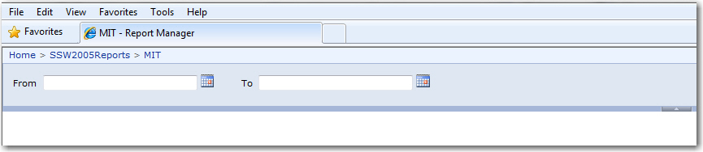
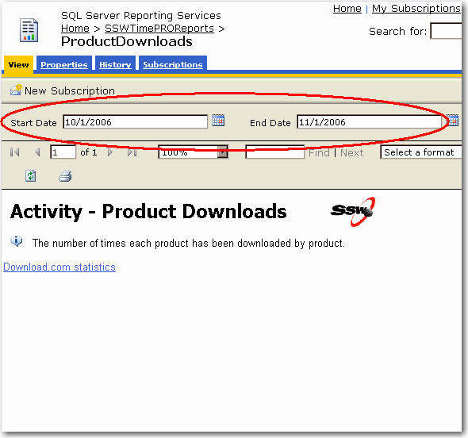
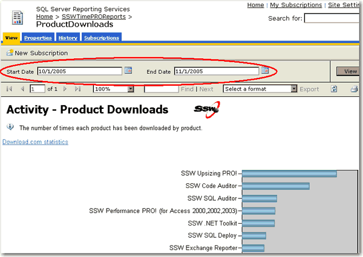
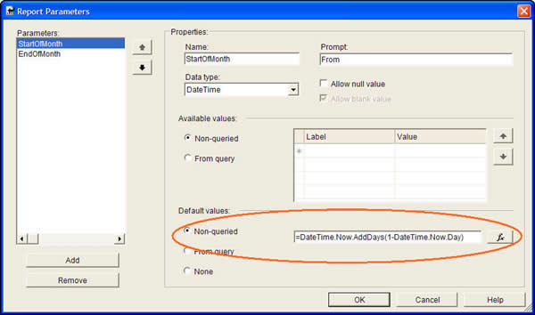
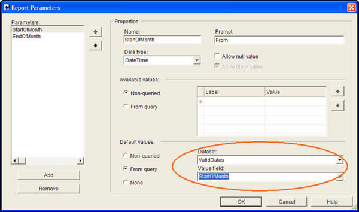
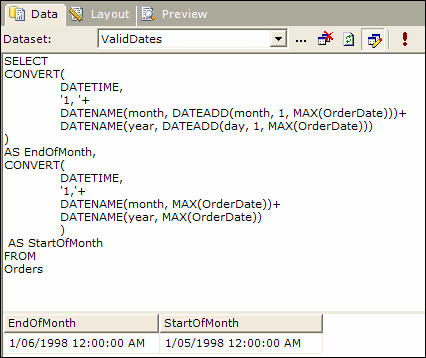

When a user opens a report, they expect to see something. It is the developer's job to get the default values for parameters right. Default parameters allow the user to see what they expect... a report, and they also show users the expected format for parameters and make it easier to run validation tests to see if all the reports on your server are working correctly And of course you don't get it right by hard coding defaults.

<!--endintro-->

::: bad  
  
:::

The following report shows nothing, because the parameters are using meaningless default values (in this case, old dates for the year 2006)

::: bad  
  
:::

::: good  

:::

In SQL Reporting Services, parameters can be:

* hard coded
* an expression, or
* from a query

Hard coded values should never be used. Expressions may be good for some instances, but because it's not linked with your data, it may not be good enough.

```sql
--Expression to get the 1st day of the previous month (aka Start Date)
DateSerial(iif( Month(DateTime.Now)=1, Year(DateTime.Now)-1, Year(DateTime.Now)), iif( Month(DateTime.Now)=1, 12, Month(DateTime.Now) - 1), 1)

--Expression to get the 1st day of the current month (aka End Date)
DateSerial(Year(DateTime.Now), Month(DateTime.Now),1)

--Expression to get the 1st day of the next month
DateSerial(iif( Month(DateTime.Now)=12, Year(DateTime.Now)+1, Year(DateTime.Now)), iif( Month(DateTime.Now)=12, 1, Month(DateTime.Now) + 1), 1)
```

::: bad  
Bad example - Expressions to set the date range to the current month
:::

::: bad  
  
:::

The Solution:

In order to give report parameters correct default values, you should always use query to generate these values from database. This will ensure your default values come from your data, so they won't fail to give some records.

```sql
**--Query to generate valid date from existing data**
SELECT
CONVERT(
DATETIME, 
'1, ' + 
DATENAME(month, DATEADD(month, 1, MAX(OrderDate)))+ 
DATENAME(year, DATEADD(month, 1, MAX(OrderDate)))
) AS EndOfMonth,
CONVERT(
DATETIME, 
'1,'+ 
DATENAME(month, MAX(OrderDate))+ 
DATENAME(year, MAX(OrderDate)) 
) AS StartOfMonth
FROM Orders
```

::: good  
Good example - Using a query to retrieve the last month of available data
:::

::: good  

:::

The dataset 'ValidDates' looks similar to this:


