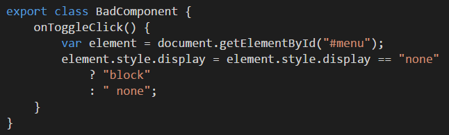
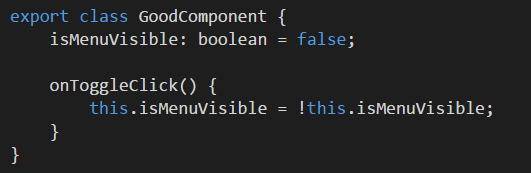

Using DOM is fine, but manipulating DOM directly in your component is not. With the introduction of Angular, there has been a big push in ensuring the DOM stays out of your JavaScript code.  It is designed in such a way that an existing Angular application can be ported to another target by simply replacing the template and template loader.  Projects such as [Angular React Native Renderer](http://angularjs.blogspot.com.au/2016/04/angular-2-react-native.html) leverages this to allow native mobile app development in Angular.

<!--endintro-->

* Smaller component code making it easier to maintain
* Faster running and easier to write unit tests
* Easier for designers to get involved

This means that the component's state must expose things that are useful to the template as public properties or fields, and the Angular should read these fields to draw itself.

::: bad  
  
:::

::: good  
  
:::
