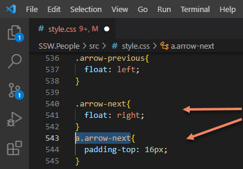

When making or editing CSS or HTML content it is important to avoid adding classes and ID's unnecessarily.

It can be tempting to add classes on elements, it is often the most obvious solution to CSS problems but doing so will lead to overly cluttered code and a host of overly specific solutions. When working on CSS it is almost always better to remove content rather than adding additional classes. 

<!--endintro-->

::: bad

:::

::: good

:::
