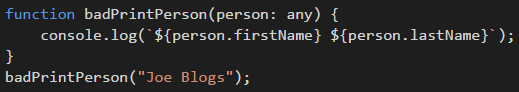
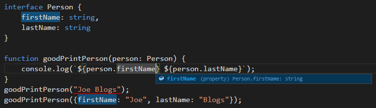

TypeScript’s any keyword is a blessing and a curse.  It is a type that can be anything, where every possible property and method exists and also returns any. It can be casted to and from anything and is how you tell the compiler to get out of your way.

However, it’s easy to use it as a crutch, and as a result, miss out on handy intellisense, refactoring support and compile-time safety – the main benefits of TypeScript!

<!--endintro-->

If you're trying to write more type-safe code, it's generally recommended to use "unknown" instead of "any" wherever possible, as it forces you to perform type checks and can help catch errors earlier in the development process.

::: bad

:::

::: good

:::

If you have ESLint enabled in your project, you can enable the [`no-explicit-any`](https://typescript-eslint.io/rules/no-explicit-any/) rule to provide useful lint warnings or errors to ensure the `any` type is not used in the project. 