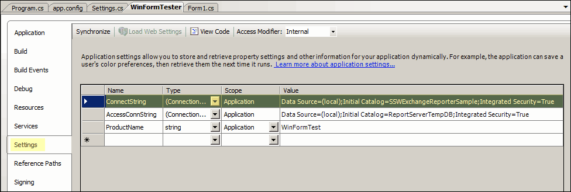

Using non strongly typed connection strings means that you have to hard code at some point in your code. Once you change the name of your connection strings, you have to change the code that references them too.

Visual Studio provides a convenient tool, called Application Settings, that allows you to manage all of your connection strings from only one location. You can use its wizard to compose connection strings quickly and correctly. Also, it provides a management class to read and write all of your connection strings.

<!--endintro-->

```cs
var connString = System.Configuration.ConfigurationManager.ConnectionStrings["MyProj.Properties.Settings.ConnectString"].ToString();
var conn = new SqlConnection(ConnString);
var cmd = new SqlCommand(strSql, conn);
conn.Open();
cmd.ExecuteNonQuery();
conn.Close();
```

::: bad
Bad Example - Using non strongly typed connection strings, the highlighted text is hard code actually
:::

::: good

:::
