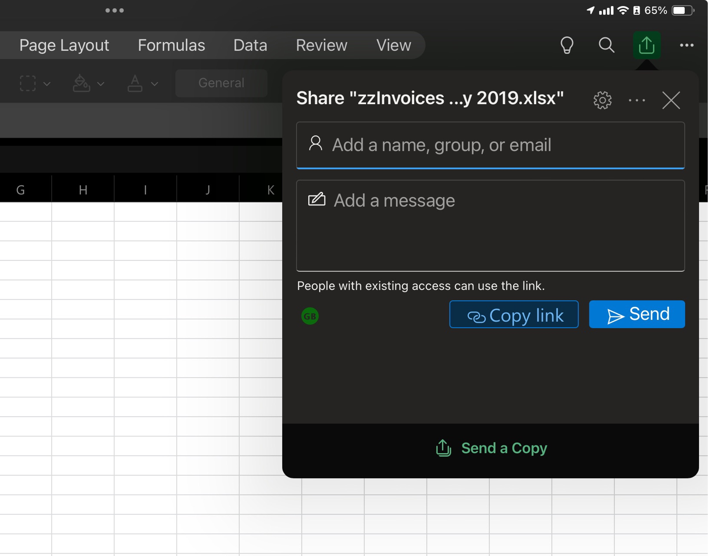
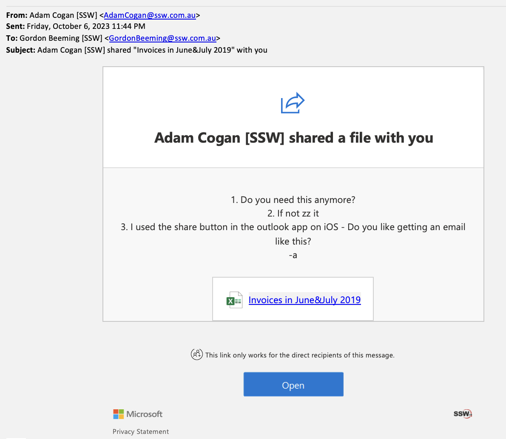

Sharing a file is easy when looking at a file. However the email people get from it will have a notification-looking, which may result in it being overlooked/ignored.

Because of that, you should avoid using that funcionality if you want people to notice and read your email. A normal email with the link and instructions should be sent instead.

<!--endintro-->

::: bad

:::

::: bad

:::

::: email-template  
|          |     |
| -------- | --- |
| From:      | Adam |
| To:      | Gordon |
| Subject: | "Invoices in June&July 2019" - Do we need this?  |  
::: email-content  

### Hi Gordon  

See this file: {{ URL }}

1. Do you need this anymore?
2. If not zz it

-a

:::  
:::  
::: good  
Figure: Good example - Link and tasks sent in a regular email  
:::

::: info
**Note:** It is a good idea to review SharePoint and Teams stats and tell users **not** to use this funcionality by pointing them to this rule.
:::
