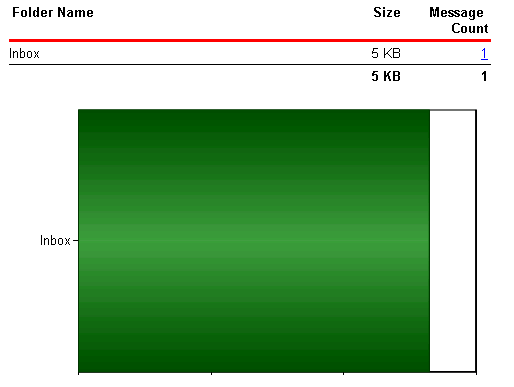
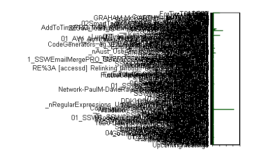
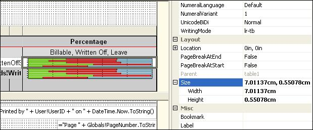
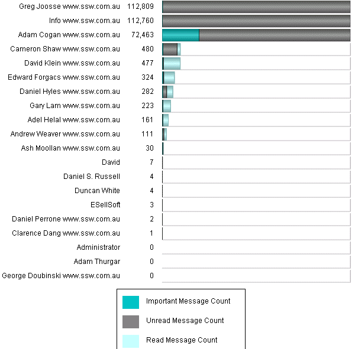
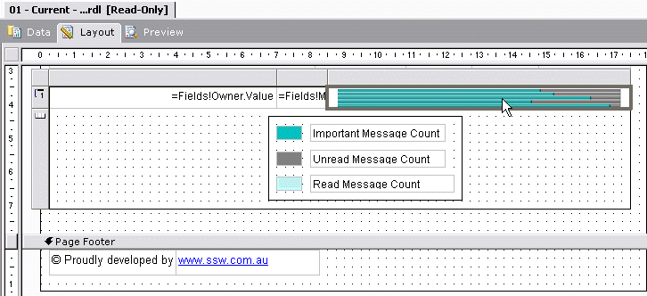

<!--endintro-->

::: bad  
  
:::

::: bad  
  
:::

The reason for this problem is that the 'size' property of the chart control doesn't support expressions like 'Count(Rows) or queried values like 'Fields!RowCount.Value', so the chart control cannot adjust its size according to the data.

The solution for this problem is to use an embedded chart within the table - this will create a dynamic chart list similar to the list shown below.

::: good  

:::

To do this, you need to create a table in your report and add a chart into each of the rows.

**Note:** When rendering a report to your browser or an email, Reporting Services generates a separate image for every single image in the report, even if they are identical. When you are using graphs, images or charts in your report, this can cause a large number of images to be generated. Always include a red warning at the top of any emailed reports so that users do not try and forward or reply to them. Use a warning like this:

**Warning:** Do not reply to or forward this report in an email - Outlook may slow down or even hang.
