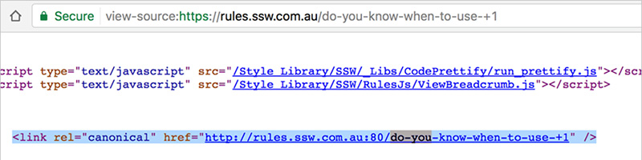

When adding a friendly URL, please avoid using specific characters like “+, :, #, &, (, ), !, *, [, ], {, }, @, /, =, $” and so on due to multiple reasons: 
 <excerpt class='endintro'></excerpt> 
<ol><li>When adding a friendly URL, we meant to make it “<strong>friendly</strong>" and “<strong>easy</strong>" for the user to read and remember, so avoid using specific characters and try to make it short.</li><li>Some characters are unsafe characters, they will be encoded, which end up making the URL really messy and ugly, e.g 
      <strong>double quote</strong> (“) will be encoded to 
      <strong>%22</strong>.</li></ol>
Some characters are reserved characters, which may not be supported by some features, based on our experience, “+" is not supported in “canonical" to redirect from 
   <b>http</b><strong></strong> to 
   <b>https</b>.​​ 
<dl class="image"><dt></dt></dl>
In the above source code, the URL 
   <a href="/do-you-know-when-to-use-+1">http://rules.ssw.com.au:80/do-you-know-when-to-use-+1</a> 
   <em>[note: don't include as a hyperlink as it's a broken URL]</em> will throw a 404 error rather than redirecting to 
   <b>https://rules.ssw.com.au:80/do-you-know-when-to-use-+1</b>,but it works fine if the URL doesn't include “+", e.g. 
   <a href=/do-you-know-when-to-use-plus-one>https://rules.ssw.com.au/do-you-know-when-to-use-plus-one</a>.

