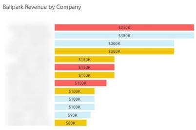

Numbers **without** decimal places offer a simpler and clearer way to present information. Embrace the [principle of "less is more"](/less-is-more) by rounding off values and leaving out zero cents in money values. This way you can make numbers easier to understand and avoid users getting lost in excessive precision. This approach promotes convenience, efficiency, and better communication, allowing users to focus on the main points without overwhelming detail or unnecessary complexity.

<!--endintro-->

::: info
You should generally **only** include decimal places (especially more than 1) for accountants that will be used for reconciliations.
:::

::: greybox
Hi Dave,

The increase in price from  
   AUD $45,750.00 + GST  
to   
   AUD $<mark>51,110.00</mark> + GST is approved by Bob 
:::
::: bad
Figure: Bad example - Having 0 cents is not necessary
:::

::: greybox
Hi Dave,

The increase in price from  
   AUD $45,750 + GST  
to   
   AUD $<mark>51,110</mark> + GST is approved by Bob 
:::
::: good
Figure: Good example - Ditch the 0 cents and have a clear number
:::

::: greybox
**Note:** The examples above are following the rule on [changing from "x" to "y"](/change-from-x-to-y).
:::

Including decimal places is unnecessary when numbers are meant to provide a general indication. The purpose of such reports is to efficiently convey easily understandable overall information. Therefore, it is advisable to prioritize simplicity and focus on presenting a comprehensive overview without delving into intricate decimal numbers.

::: good

:::
