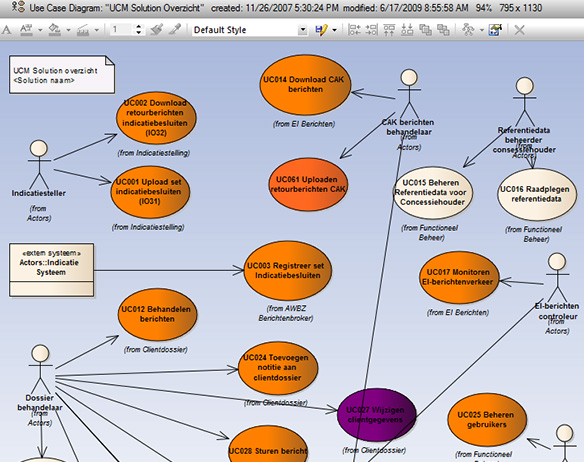
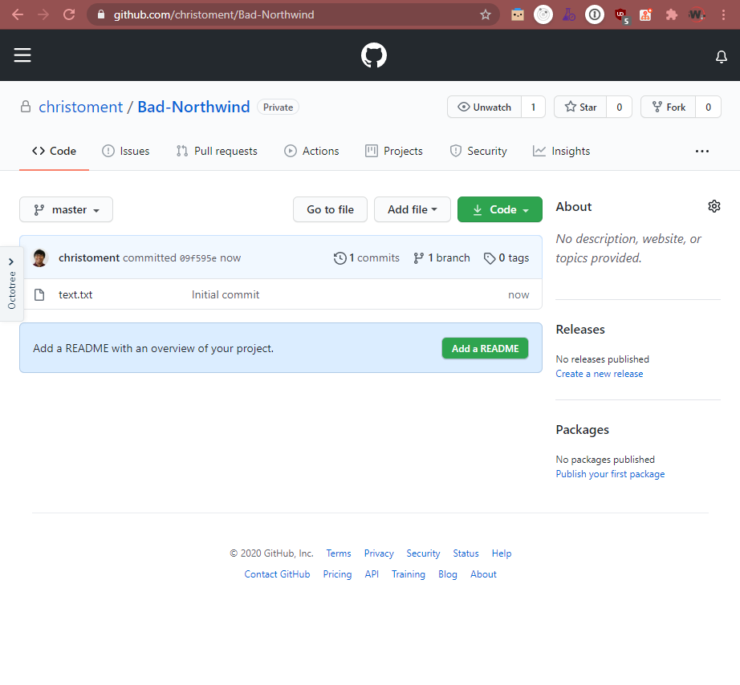
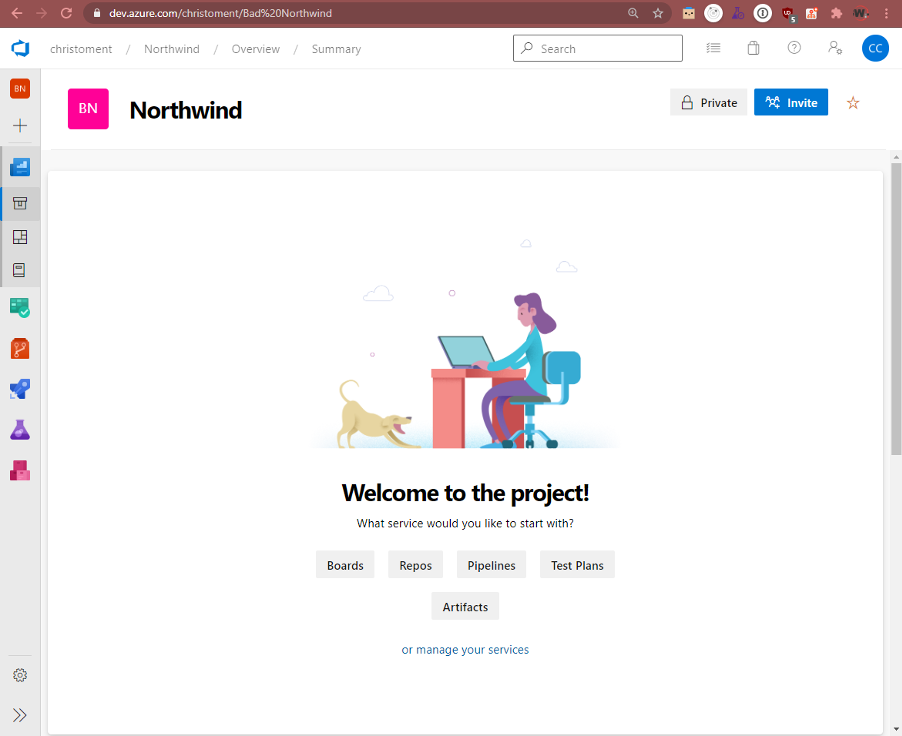
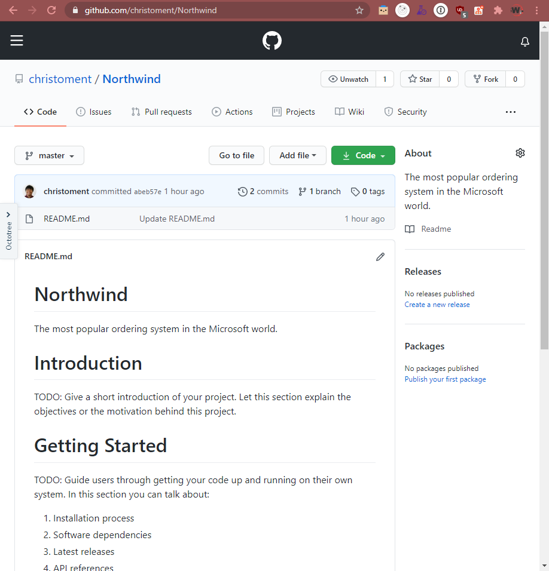
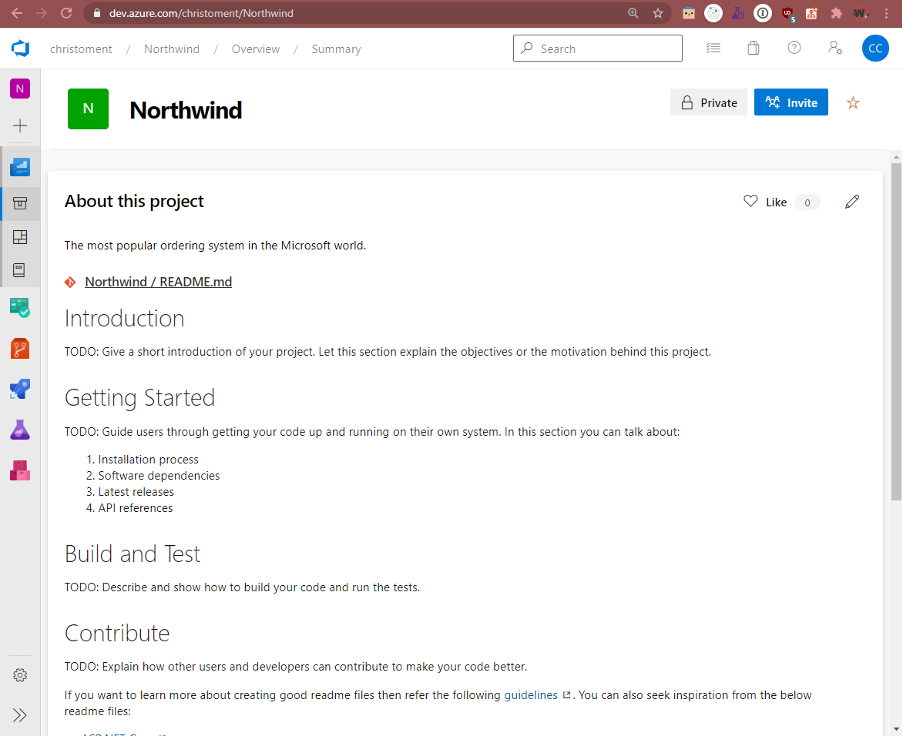
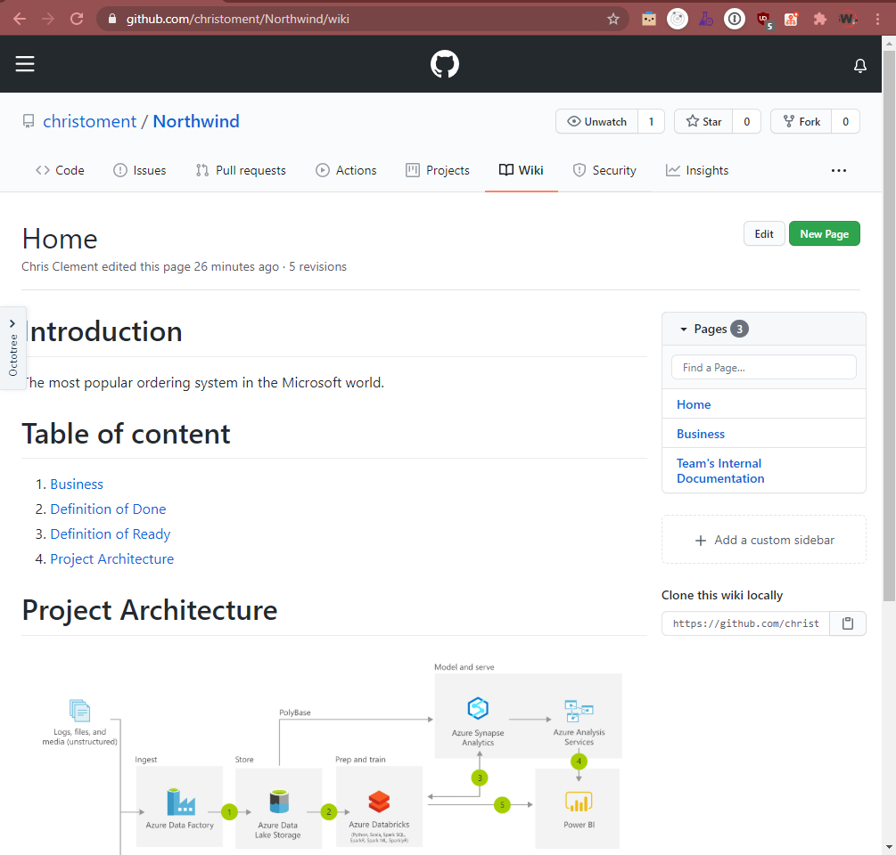
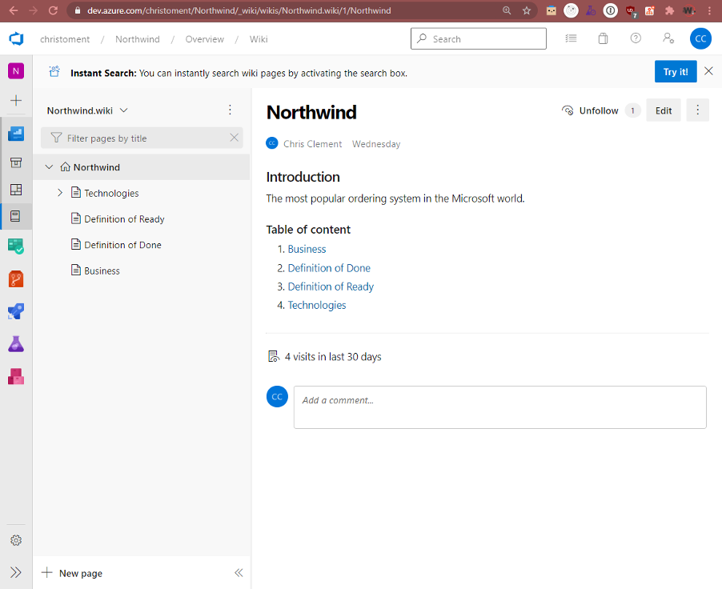
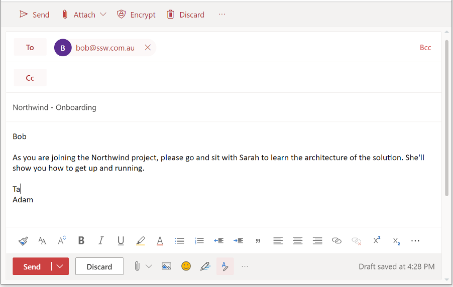

There are a few styles of documentation:

<!--endintro-->

### ❌ Bad example – Old School

::: bad  
  
:::

The old school way is document first – lots of planning and lots of heavy documentation created upfront before even a single line of code is written.

This is the method most familiar to teams who are comfortable with Waterfall and have possibly never heard of Agile. Documentation can normally be characterized by:

* Heavy, long documents
* Sequence Diagrams
* UML

This is a well-established way to do documentation, but it has several problems:

* Gets out of date quickly
* High maintenance overhead
* Needs a business analyst

::: bad  
  
:::

::: bad  
  
:::

There may be exceptions – some situations benefit from this kind of documentation; for example, it may be necessary to support a business case – although a well-defined spec is a better document to support a business case.

::: greybox
 **More info:** [Rules to Better Specification Reviews](/rules-to-better-specification-reviews)
:::

**Tip:** Documentation should be as minimal as possible. If your circumstances require this style of documentation, start by limiting it to just enough to cover your first couple of Sprints. And recognize that by going down this path you make a commitment to keeping it up-to-date.

### ✅ Good example – The 8 Important Documents

This style of documentation is used by modern teams who are Agile only.

**In the repository (for developers):**

**1. README.md** – Gives an overview of the project and provides links to the rest of the documentation. It is important for the README.md to show a high-level architecture diagram that illustrates the overarching solution.

**2. _docs\Instructions-Compile.md** – Instructions on how to build and run the project (aka the F5 experience).

**3. _docs\Instructions-Deployment.md** – Explains how to deploy the solution, including any additional processes (e.g. DevOps)

**4. _docs\Business.md** – Explains the purpose of the application, including the problem, goals and statement of intent.

**5. _docs\Technologies-and-Architecture.md** – Provides a technical overview of the solution.
* A link to an [architecture diagram](/architecture-diagram) which outlines a high-level overview of the project. 
* Links to any lower level architecture diagrams of the system e.g. [Azure resources diagram (auto generated)](/azure-resources-diagram)
* Coding patterns followed (e.g. [Clean Architecture](/rules-to-better-clean-architecture/))
* 3rd party libraries used 
* 3rd party services used 
* A link to all [package-audit-logs](/package-audit-log)
* A link to [ADRs (Architectural Decision Records)](/do-you-use-architectural-decision-records/)

**6. _docs\Alternative-Solutions-Considered.md** – explains other options that were discounted. For example
  * We chose to use a code-centric .NET solution over a low code solution because we did not want to be locked into any specific vendor e.g. Dynamics, Outsystems.
  * We chose to use Angular over React because 5/6 developers on the project were more familiar with Angular.
  * We chose to use Azure over on-premises to avoid procurement of costly servers.
  * Note: If you decide after the fact that the chosen solution is wrong, this should be explained. Include what led to the current circumstances and if there is a planned change.

**7. _docs\Definition-of-Done.md** - Ensures that your team [maintains a high level of quality with a Definition of Done](/definition-of-done)

**8. _docs\Definition-of-Ready.md** – Ensures that all your PBIs are well defined to an agreed standard before adding them to a Sprint (see [have-a-definition-of-ready](/have-a-definition-of-ready))

Keeping these documents in the repository means that you ensure that any documentation the developers need to work on or run the code is where they need it - with the code.

It also means that when a developer makes a change to the code that needs an update to the documentation, the documentation changes can be checked in along with the code in the same commit.

**Exposing documentation through a Wiki (for developers and other stakeholders):**

Documents to be read or edited by the Product Owner (or other members of the Scrum team) should be exposed through a Wiki. The advantage of this approach is that the writing experience in the Wiki is more friendly for non-developers. The Wiki should be sourced from the repo **docs\\** folder to ensure documentation is kept up-to-date. There are several options for creating a Wiki:

Azure DevOps wiki options:
* [Wiki edited via the repo](https://docs.microsoft.com/en-us/azure/devops/project/wiki/publish-repo-to-wiki?view=azure-devops&tabs=browser) (recommended)
* [Wiki edited via the portal](https://docs.microsoft.com/en-us/azure/devops/project/wiki/wiki-create-repo?view=azure-devops&tabs=browser)
* An alternative Wiki platform (e.g. [Confluence](https://www.atlassian.com/software/confluence))

GitHub wiki options:
* [Markdown files edited via the repo](https://docs.github.com/en/github/managing-files-in-a-repository/editing-files-in-your-repository) (recommended)
* The [GitHub repo Wiki](https://docs.github.com/en/communities/documenting-your-project-with-wikis/about-wikis)
* An alternative Wiki platform (e.g. [Confluence](https://www.atlassian.com/software/confluence))

**Tip:** You can publish your documentation from the repo using [GitHub Pages](https://pages.github.com)

**Tip:** All of your documents (in your Wiki and your repository) should be [written in Markdown](/using-github-and-markdown-to-store-you-content).

::: bad  
  
:::

::: bad  
  
:::

  

::: good  
  
:::

::: good  
  
:::

::: good  
  
:::

**Tip:** Use your documentation for onboarding developers

::: bad  
  
:::

::: good  
  
:::

**Tip:** Keep your documentation as minimal as possible - automate the F5 experience and deployment process (documents 2 and 3) using PowerShell scripts. Then your documents can just say "run these scripts"

### The rest of the jigsaw

**Update your Acceptance Criteria** - If you use a policy that requires commits to be linked to PBIs, then you understand that the PBI is now the documentation. If requirements change (based on a conversation with the Product Owner of course) then the PBI should be updated.

When updating the Acceptance Criteria, ~~strike through~~ the altered Acceptance Criteria, and add the new ones. Get the PO to confirm your understanding.

::: greybox
Example:

~~Enter search text, click ‘Google’, and see the results populate below.~~   
[Updated] Enter search text and automatically see the results populate below.  
:::

This should be added to the [Definition of Done](/definition-of-done).

### Technical Debt

**What's "Technical Debt"?**

During a project, when you add functionality, you have a choice:

* One way is quick but messy - it will make further changes harder in the future (i.e. quick and dirty).

* The other way is cleaner – it will make changes easier to do in the future but will take longer to put in place.

'Technical Debt' is a metaphor to help us think about this problem. In this metaphor (often mentioned during Scrum software projects), doing things the quick and dirty way gives us a 'technical debt', which will have to be fixed later. Like financial debt, the technical debt incurs interest payments - in the form of the extra effort that we must do in future development.

We can choose to continue paying the interest, or we can pay the debt in full by redoing the piece of work in a cleaner way. Learn about [the importance of paying back technical debt.](/technical-debt/)

The same principle is true with documentation. Using the 'old school' method will leave you with a build-up of documentation that you will need to keep up to date as the project evolves.

**Warning:** If you want to follow Scrum and have zero technical debt, then you must throw away all documentation at the end of each Sprint. If you do want to keep it, make sure you add it to your [definition of done](/definition-of-done) to keep it updated.
