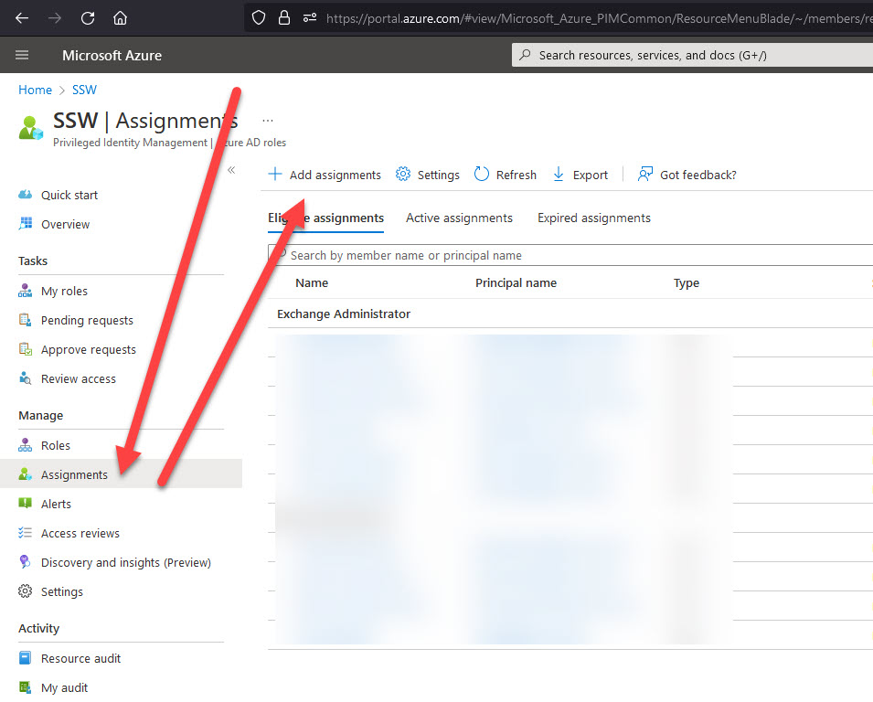
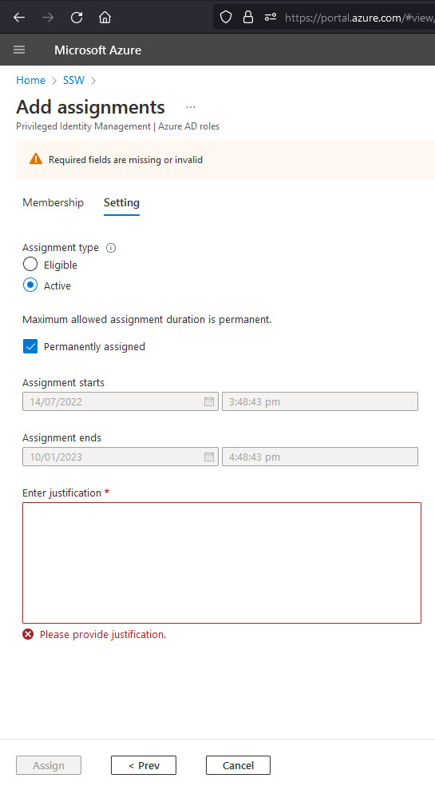
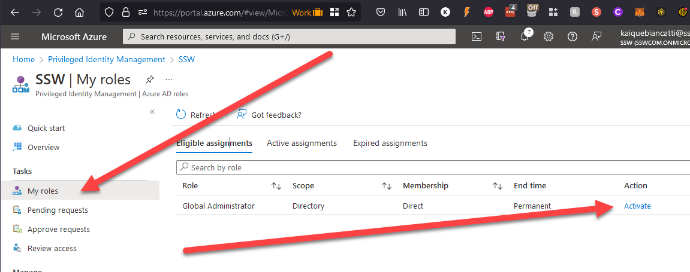
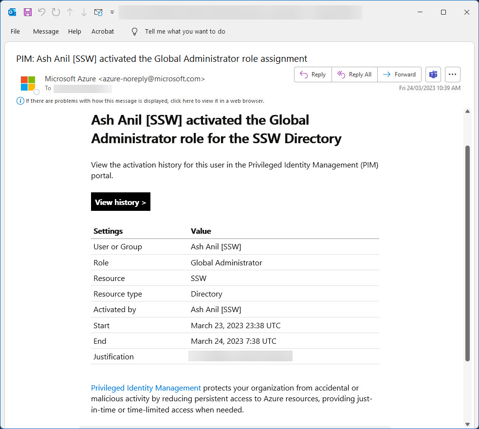

Azure AD PIM (Privileged Identity Management) enables a more secure, manageable and monitorable approach to assigning privileged permissions in your organization.

<!--endintro-->

PIM enables just-in-time privileged access for users that are eligible for it, reducing the chance of privileged actions being done by malicious (or unaware) actors.

Things that we can do with PIM (taken from <https://docs.microsoft.com/en-us/azure/active-directory/privileged-identity-management/pim-configure>):

* Provide **just-in-time** privileged access to Azure AD and Azure resources
* Assign **time-bound** access to resources using start and end dates
* Require **approval** to activate privileged roles
* Enforce **multi-factor authentication** to activate any role
* Use **justification** to understand why users activate
* Get **notifications** when privileged roles are activated
* Conduct **access reviews** to ensure users still need roles
* Download **audit history** for internal or external audit
* Prevents removal of the **last active Global Administrator** and **Privileged Role Administrator** role assignments

### Adding assignments in PIM

As best practice, your company should use PIM to give access to new SysAdmins.

Do the following:

1. Go to PIM at <https://portal.azure.com/#view/Microsoft_Azure_PIMCommon/ResourceMenuBlade/~/MyActions/resourceId//resourceType/tenant/provider/aadroles>
2. Go to Assignments | Add Assignment:

   
3. Select Role | Select members | Next
4. Here, you have 2 options: Eligible or Active.

   1. Eligible: The member is **eligible** for activating the permissions, permanently or for a set period of time. Every time they activate, they will have the permissions for up to 8 hours, then they will lose it and will need to activate again. Activating is a manual process of going to PIM and clicking "Activate".
   2. Active: The member has the permissions **active**, forever or for a set period of time. They don't need to perform any manual steps to activate anything.
5. Select the correct one | Add a justification | Assign:

   

   You are now assigned roles in PIM.

### Activating assignments in PIM

If you are eligible for assignments, you can activate them by doing the following:

1. Go to <https://portal.azure.com/#view/Microsoft_Azure_PIMCommon/ResourceMenuBlade/~/MyActions/resourceId//resourceType/tenant/provider/aadroles>
2. Click on My Roles | Role | Activate:
   
3. Go through the steps to add a justification and time you need that access for.

You now have that role active for you, for up to 8 hours.

### Receiving PIM alerts on your email

PIM has built-in alerts that will send an email when assignments are activated, together with its justification, who activated it, the role activated, and extra information:

