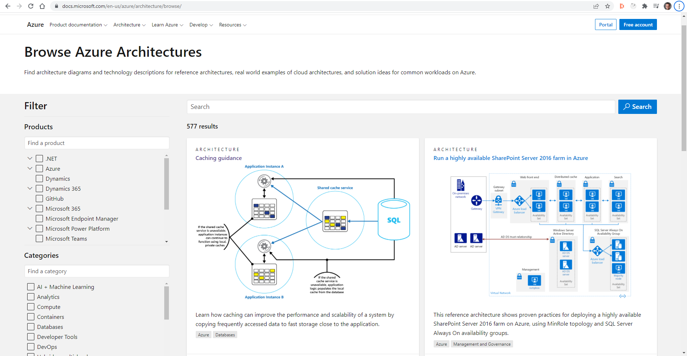
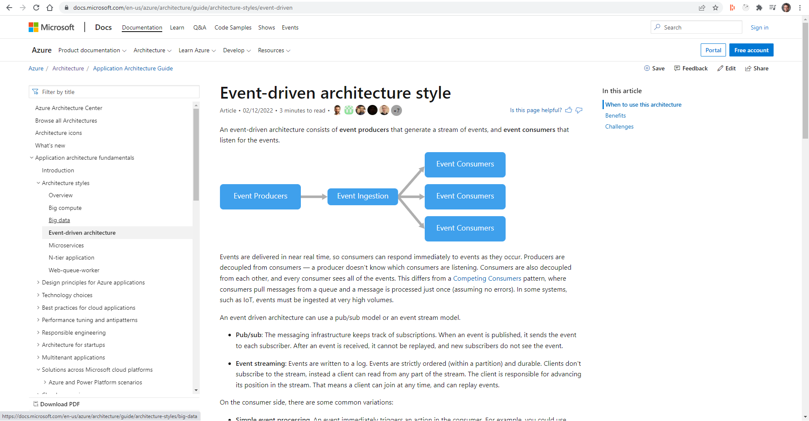

Azure Architecture Center (https://docs.microsoft.com/en-us/azure/architecture/
) is a one stop shop for all things Azure Architecture. It’s got a library of reference implementations to get you started. Lots of information on best practices from the big decisions you need to make down to the little details that can make a huge difference to how your application behaves.

## Reference Architectures

The architectures presented fit into 2 broad categories:
- Complete end to end architectures. These architectures cover the full deployment of an application.
- Architectures of a particular feature. These architectures explain how to incorporate a particular element into your architecture. The Caching example above explains how you might add caching into your application to improve performance.

Each architecture comes with comprehensive documentation providing all the information you need to build and deploy the solution.

## Best Practices

The Best Practices is a very broad set of documentation from things like performance tuning all the way through to designing for resiliency and some of the more common types of applications and their requirements.
Because of this there is almost always something useful, no matter what stage your application is at. Many teams will add a sprint goal of looking at one best practise per sprint or at regular intervals. The Product Owner would then help prioritise which areas should be focussed on first.