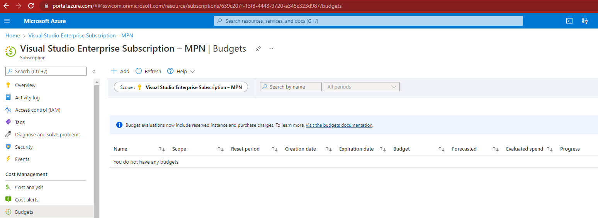
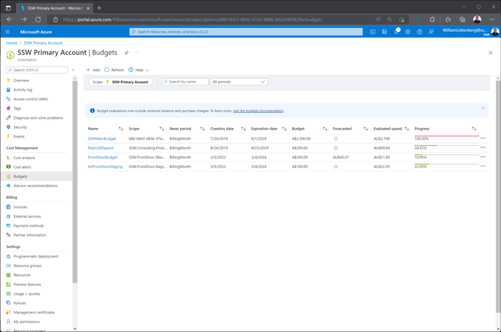
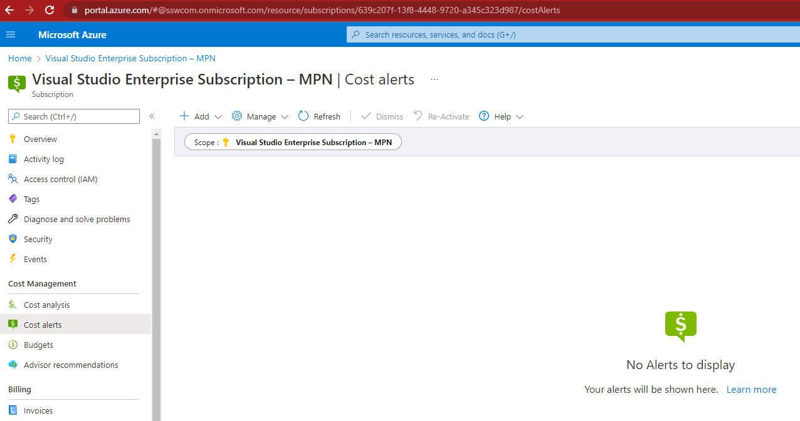
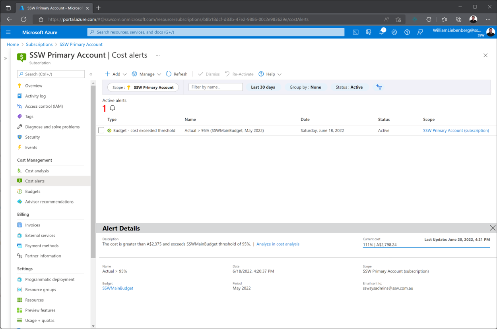
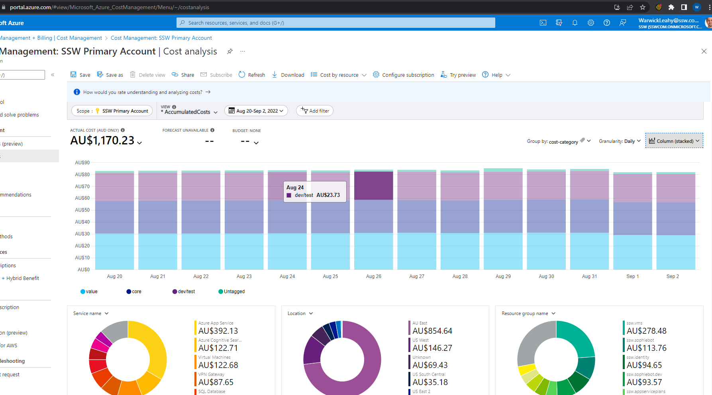
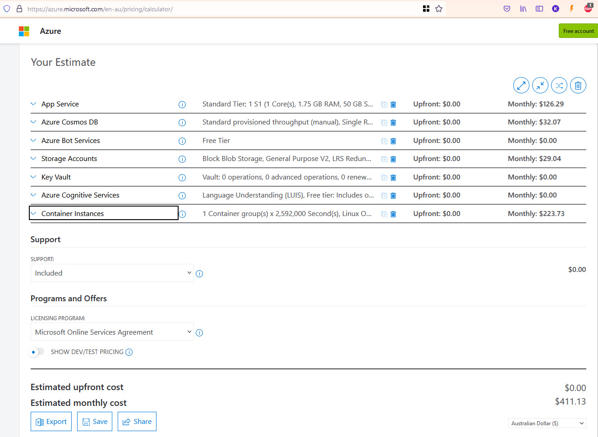

Azure costs can be difficult to figure out and it is important to make sure there are no hidden surprises. To avoid bill shock, it is crucial to be informed. Once you are informed, then you can [make the appropriate actions to reduce costs](/reduce-azure-costs).

Let's have a look at the tools and processes that can be put in place to help manage Azure costs:

<!--endintro-->

`youtube: https://www.youtube.com/embed/G7JEz8b-G24`
**Video: Monitoring your Azure $ costs with Warwick Leahy (4 min)**

### Budgets - Specify how much you aim to spend

Budgets are a tool that allow users to define how much money is spent on either an Azure Subscription or a specific resource group.

It is critical that an overarching budget, is set up for every subscription in your organization. The budget figure should define the maximum amount expected to be spent every month.

In addition to the overarching budget, specific apps can be targeted to monitor how much is being spent on them. Each time a new service is proposed, it is a good idea to have a cost conversation. Remember to jump into Azure and create a new budget to monitor that app.

### Subscriptions - Split costing by environment

In addition to budgets, it's also a good idea to split costing between production and non-production scenarios. This can help diagnose why there are unexpected spend fluctuations e.g. performed load testing on the test site. Also, there are sometimes discounts that can be applied to a subscription only used for dev/test scenarios.  

::: bad

:::

::: good

:::

### Cost alerts - Make sure you know something has gone wrong

Once a budget is set up, cost alerts are the next important part for monitoring costs. Cost alerts define the notifications that are sent out when budget thresholds are being exceeded. For example, it might be set to send out an alert at 50%, 75%, 100% and 200%.

Make sure to set up alerts on all the thresholds that are important to the company.

If the company is really worried about costs, an Azure runbook could even be set up to disable resources after exceeding the budget limit. However, that isn't a very common practice since nobody wants the company website to go down randomly!

::: bad

:::

::: good

:::

### Cost analysis - What if you get an alert?

It can be scary when you get an alert. Luckily, Azure has a nice tool for managing costs, called [Cost Analysis](https://docs.microsoft.com/en-us/azure/cost-management-billing/costs/quick-acm-cost-analysis). You can break down costs by various attributes (e.g. resource group or resource type).

Using this tool helps identify where the problem lies, and then you can build a plan of attack for handling it.

::: info
**Note:** If your subscription is a Microsoft Sponsored account, you can't use the Cost Analysis tool to break down your costs, unfortunately. Microsoft has this planned for the future, but it's not here yet.
:::

### Tag your resources - Make it easier to track costs

Adding a tag of cost-category to each of your resources makes it easier to track costs over time. This will allow you to see the daily costs of your Azure resources based on whether they are Core, Value adding or Dev/Test. Then you can quickly turn off resources to save money if you require. It also helps you to see where money is disappearing.

Running a report every fortnight (grouped by the cost-category tab) will highlight any spikes in resource costs - daily reports are probably too noisy, while monthly reports have the potential for overspend to last too long.

### Approval process - Don't let just anyone create resources

Managing the monthly spend on cloud resources (e.g. Azure) is hard. It gets harder for the [Spend Master (e.g. SysAdmins)](/do-you-have-an-azure-spend-master) when developers add services without sending an email to aid in reconciliation.

Developers often have high permissions (e.g. Contributor permissions to a Resource Group), and are able to create resources without the Spend Master knowing, and this will lead to budget and spending problems at the end of the billing cycle.

For everyone to be on the same page, the process a developer should follow is:

1. Use the [Azure calculator](https://azure.microsoft.com/en-au/pricing/calculator) - Work out the monthly resource $ price
2. Email the Spend Master with $ and a request to create resources in Azure, like the below:

::: email-template
|          |     |
| -------- | --- |
| To:      | Spend Master |
| Subject: | Purchase Please - Azure Resource Request for {{ PRODUCT/SERVICE }} |
::: email-content  

### Hi Spend Master aka SysAdmins

I would like you to provision a new Azure Resource for {{ PRODUCT/SERVICE }}.
This is for {{ BUSINESS REASONS FOR RESOURCE }}

* Azure Resource needed: I would like to create a new App Service Plan
* Azure Calculator link: {{ LINK }}
* Environment: {{ DEV/STAGING/PROD }}

Project details:

* Project Name: A new project called {{ PROJECT NAME }}
* Project Description (The SysAdmin will copy this info to the Azure Tag): {{ DESCRIPTION }}
* Project URL (e.g. Azure DevOps / Github): {{ URL }}

Total:

${{ AMOUNT }} AUD + GST/month

OR

${{ AMOUNT }} AUD + GST/year

1. Please approve

\< As per <https://ssw.com.au/rules/azure-budgets> \>
:::
:::

3. If the request is approved, remember to add a cost-category tag to the new resource once it is created
