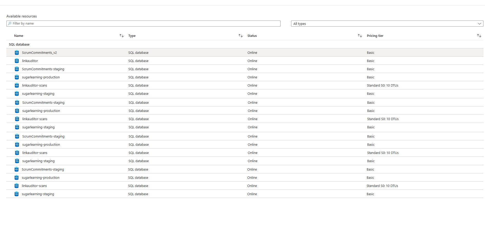
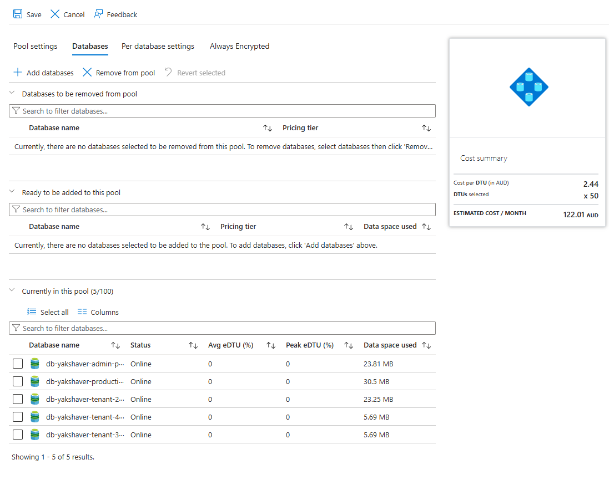

Choosing the right Azure database model is essential for building scalable, cost-effective, and efficient multi-tenant applications. With Azure SQL offering multiple deployment options, selecting the optimal model requires a clear understanding of your application's tenant structure, usage patterns, and data isolation requirements.

<!--endintro-->

## What's the pain?

Many developers struggle to choose the right database model for multi-tenant applications. Picking the wrong option can lead to unnecessary costs, scalability issues, or poor performance. For example:

* A SaaS application serving 200 tenants may use a single database per tenant, leading to high costs and underutilized resources
* Conversely, pooling all tenants in one shared database might create security risks or performance bottlenecks

::: greybox
**Tip:** Even before you choose a database model, consider if your application truly needs a multi-tenant architecture. Single-tenant architecture might be simpler for some use cases.
:::

## Common Mistakes When Choosing Database Models

### One-Size-Fits-All Approach

Some developers apply the same database model regardless of tenant requirements, workload patterns, or scale. This often leads to inefficiencies and increased costs.

::: bad

:::

### Ignoring Security Considerations

Pooling tenants in a shared database without proper security measures can expose sensitive data across tenants.

```sql
-- No row-level security, just application-level filtering
SELECT * FROM SalesData WHERE TenantID = @TenantID;
```

::: bad
Figure: Bad Example – No row-level security exposes all tenant data if a query bypasses application logic
:::

## Azure SQL Database Models - Your Options

Azure SQL offers several deployment models to suit different scenarios. Here's how to choose the right one for your needs:

### Option A: Single Database per Tenant

Each tenant gets its own dedicated Azure SQL Database.

**✅ Advantages:**
* Full tenant isolation
* Independent scaling for each tenant
* Simplified backup/restore for individual tenants

**❌ Disadvantages:**
* High costs as tenant count grows
* Management complexity increases with more databases
* Inefficient resource utilization for inactive tenants

**Best for:**
* Applications with strict data isolation requirements (e.g., regulatory compliance)
* Scenarios with few tenants or high-value clients

### Option B: Elastic Pool (Recommended for most scenarios)

Multiple single-tenant databases share resources within an elastic pool.

**✅ Advantages:**
* Cost-effective for variable workloads
* Maintains data isolation between tenants
* Dynamically allocates resources based on demand

**❌ Disadvantages:**
* Requires careful pool sizing to avoid over/under-provisioning
* Limited cost savings for very inactive tenants

**Best for:**
* Applications with variable usage patterns across tenants
* Scenarios where some tenants are inactive at any given time
* Both small and large numbers of tenants, depending on workload characteristics

::: good

:::

### Option C: Shared Multi-Tenant Database

All tenants share a single database with a schema that includes tenant identifiers.

**✅ Advantages:**
* Lowest per-tenant cost
* Simplified management and deployment
* Efficient resource utilization

**❌ Disadvantages:**
* Reduced tenant isolation
* Security implementation requires proper Row-Level Security (RLS)
* Harder to restore individual tenant data

**Best for:**
* Applications with hundreds or thousands of tenants
* Scenarios where cost efficiency is paramount and strict isolation isn't required

::: good

```sql
-- Implementing Row-Level Security in a shared database
CREATE SECURITY POLICY TenantFilter  
ADD FILTER PREDICATE rls.fn_TenantAccessPredicate(TenantID) 
ON dbo.SalesData;
```

Figure: Good Example – Row-level security ensures tenant isolation at the database level
:::

### Option D: Serverless

Azure SQL's serverless tier automatically scales compute resources based on workload demand.

**✅ Advantages:**
* Ideal for unpredictable workloads or inactive periods
* Pay only for active usage (per-second billing)
* Automatic pause/resume reduces costs during inactivity

**❌ Disadvantages:**
* Cold start delays when resuming from pause
* Limited scaling range (0.5-16 vCores in General Purpose tier)

**Best for:**
* Development/test environments
* Early-stage SaaS applications with uncertain growth patterns

::: info
**Tip:** Serverless is perfect for development environments where the database is only used during working hours, automatically pausing outside of these times to save costs.
:::

### Option E: Hyperscale

The Hyperscale service tier supports very large databases and extreme scalability requirements.

**✅ Advantages:**
* Supports databases up to 100 TB
* Fast backups and restores
* Near-instant read scale-out capabilities

**❌ Disadvantages:**
* Higher costs compared to other tiers
* Overhead in managing very large datasets

**Best for:**
* Applications requiring massive storage or extreme scalability (e.g., analytics platforms)

### Option F: Hybrid Approaches

Combine multiple models or technologies to address diverse requirements.

**✅ Advantages:**
* Optimized cost-to-performance ratio for different tenant tiers
* Flexibility to meet various tenant requirements
* Ability to scale different components independently

**❌ Disadvantages:**
* Increased architectural complexity
* Higher operational overhead managing multiple systems
* Potential for increased development costs

**Examples:**
* Use Azure SQL Database for relational data and Cosmos DB for globally distributed NoSQL data
* Tiered service levels:
  * High-value tenants on dedicated databases
  * Low-value tenants in a shared database

**Best for:**
* SaaS platforms with diverse tenant profiles or tiered pricing models
* Applications with mixed data access patterns
* Systems requiring both OLTP and OLAP capabilities

::: good
**Cost Optimization Example:** A financial services platform uses a hybrid approach where premium clients ($10,000+/month) get dedicated databases with guaranteed performance, while standard clients share elastic pools, and entry-level clients use a multi-tenant database with row-level security. This approach optimizes both performance and cost across different customer segments.
:::

## Decision Framework

When choosing the right Azure database model for your multi-tenant application, use this decision framework:

::: greybox
**Step 1:** Determine your isolation requirements
* Do you need physical isolation (dedicated DB) or is logical isolation (RLS) sufficient?
* Are there regulatory/compliance requirements?

**Step 2:** Analyze your tenant workload patterns
* Are workloads predictable or variable?
* Do tenants have similar usage patterns or different ones?

**Step 3:** Consider your scaling requirements
* How many tenants do you expect now and in the future?
* What is the expected data volume per tenant?

**Step 4:** Evaluate your budget constraints
* What is your per-tenant cost target?
* Are you optimizing for predictable costs or minimal costs?
:::

## Cost Considerations

When planning costs, consider more than just compute pricing:

* **Compute Resources:** vCores/DTUs
* **Storage Costs:** Allocated storage and backup retention
* **IO Operations:** Read/write operations can add up in high-throughput applications
* **Network Egress:** Data transfer out of Azure regions incurs charges

::: good
**Example Scenario:** A SaaS provider with 50 small business clients switched from dedicated databases (S2 tier, $75/month each) to an Elastic Pool (S2, 50 DTUs/database, 200 total DTUs at $560/month), reducing costs by over 85% while maintaining performance and isolation.
:::

## Security Best Practices

Even with separate databases, proper security measures are essential:

1. Use Azure AD Authentication for centralized identity management
2. Implement Row-Level Security (RLS) in shared databases
3. Enable Transparent Data Encryption (TDE) for all databases
4. Use Always Encrypted for sensitive data fields
5. Implement proper audit logging with Azure SQL Auditing

## Conclusion

Choosing the right Azure database model requires balancing cost, scalability, and isolation needs. While single databases offer maximum isolation, elastic pools and shared databases provide cost-efficient alternatives for multi-tenancy at scale. Serverless tiers excel in handling unpredictable workloads, while Hyperscale supports extreme scalability demands.

By carefully evaluating your application's requirements and leveraging Azure's diverse offerings, you can design an optimal architecture that scales efficiently while controlling costs.

::: info
**Note:** Always consider future growth patterns when selecting your database model. It's easier to start with a more isolated model and consolidate later than to separate tenants after they're combined.
:::
