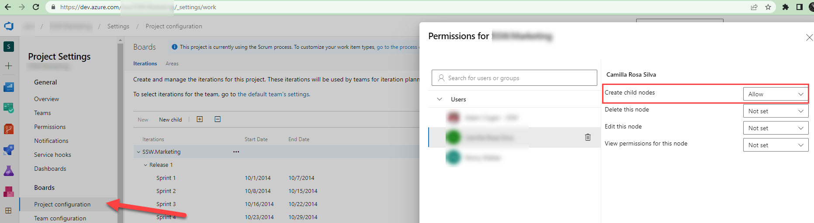
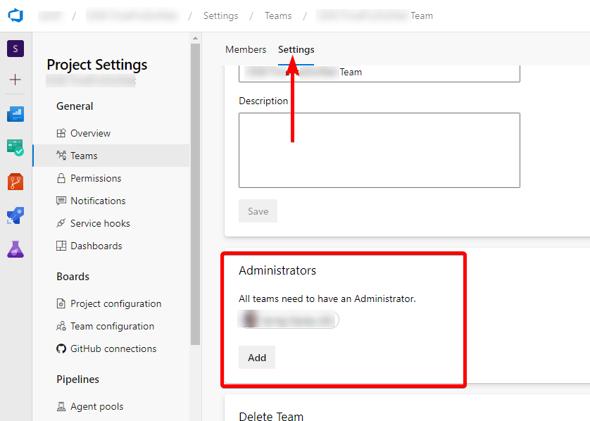

When setting Azure DevOps permissions, it is important to give people only the permissions they need to do their job, rather than giving blanket admin access. This approach helps to minimize the risk of unwanted changes or errors, as well as ensure that sensitive data is only accessible to those who need it.

<!--endintro-->

## How to give write access to a project without admin rights

Instead of giving Project Admin access to all team members in Azure DevOps, it is recommended to give specific permissions only for the areas or iterations they need to work on. This can be done by allowing users to create nodes under the specific area or iteration they are responsible for, rather than giving them blanket access to the entire project.

Example: To create Sprints in Azure DevOps, you only need two bits of permission:

1. Create child nodes on the backlog node for the team.  
  a. Navigate to the project in Azure DevOps | Project Settings    
b. Under "Boards" select Project configuration | Click on the ellipses (...) on Interations |  Security  
c. Add users and assign particular permission. 

2. You need to be a team admin, in order to add the newly created iteration to the team iterations.  

By following this rule and giving people only the specific permissions they need, you can help to ensure that Azure DevOps permissions are set up in a way that maximizes productivity and minimizes the risk of errors or unwanted changes.

