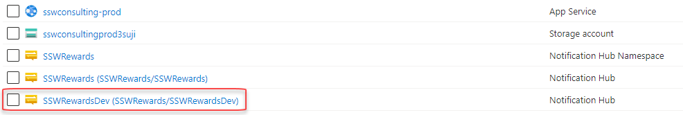
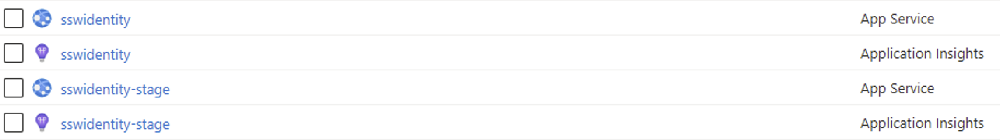
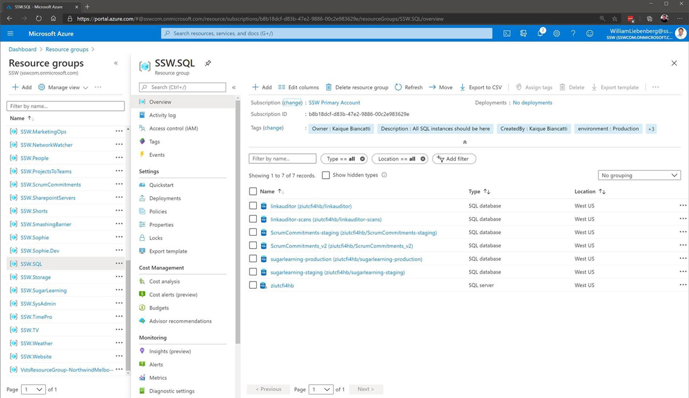
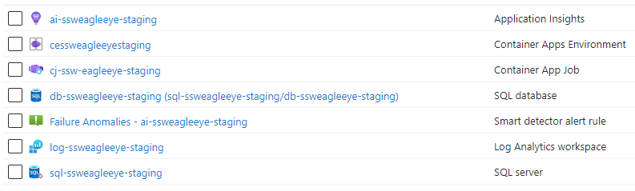

## Naming your Resource Groups

Resource Groups should be logical containers for your products. They should be a one-stop shop where a developer or sysadmin can see all resources being used for a given product, within a given environment (dev/test/prod). Keep your Resource Group names consistent across your business, and have them identify exactly what's contained within them.

Name your Resource Groups as **Product.Environment**. For example:

* Northwind.Dev
* Northwind.Staging
* Northwind.Production

There are no cost benefits in consolidating Resource Groups, so use them! Have a Resource Group per product, per environment. And most importantly: **be consistent in your naming convention**.

<!--endintro-->

### Keep your resources in logical, consistent locations

You should keep all a product's resources within the same Resource Group. Your developers can then find all associated resources quickly and easily, and helps minimize the risk of duplicate resources being created. It should be clear what resources are being used in the Dev environment vs. the Production environment, and Resource Groups are the best way to manage this.

::: bad

:::

### Don't mix environments

There's nothing worse than opening up a Resource Group and finding several instances of the same resources, with no idea what resources are in dev/staging/production. Similarly, if you find a single instance of a Notification Hub, how do you know if it's being built in the test environment, or a legacy resource needed in production?

::: bad

:::

### Don't categorize Resource Groups based on resource type

There is no cost saving to group resources of the same type together. For example, there is no reason to put all your databases in one place. It is better to provision the database in the same resource group as the application that uses it.

::: bad

:::

::: good

:::
