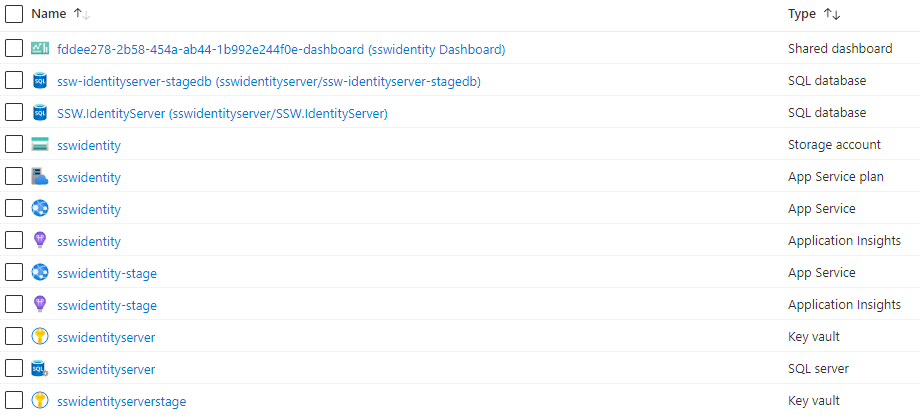
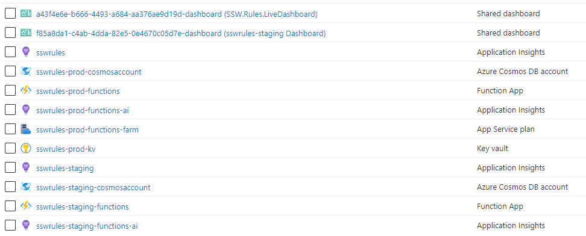

Organizing your cloud assets starts with good names. It is best to use:

* all lower case 
* use kebab case (“-“ as a separator)
* include which environment the resource is intended for i.e. dev, test, prod, etc.
* do not include the Resource Type in the name (Azure will show this anyway)
* if applicable, include the intended use of the resource in the name e.g. an app service may have a suffix *api*

<!--endintro-->

Azure defines [naming rules and restrictions for Azure resources](https://docs.microsoft.com/en-us/azure/azure-resource-manager/management/resource-name-rules).

Having inconsistent resource names across projects creates all sorts of pain. New developers will struggle to find a project's resources, identify what those resources are being used for, and will have no idea what they should call *new* resources they need to create. Additionally, you run the risk of having duplicate resources created because a developer has no idea that another developer created the same thing 6 months ago, under a different name, in a different Resource Group!

## Keep your resources consistent
If you're looking for resources, it's much easier to have a pattern to search for. At a bare minimum, you should keep the name of the product in the resource name, so finding them in Azure is easy. At SSW, we try to follow the "ssw-productname-environment" naming convention.

## Keep your resources in logical, consistent locations
You should keep all resources for a given project within the same Resource Group(s). Your developers can then find all associated resources quickly and easily, and helps minimize the risk of duplicate resources being created. 

There may be times where it's more sensible to extract certain resources out into more general Resource Groups (e.g. Azure FrontDoor, WAF, and sometimes SQL), but these should be done by exception and only after careful consideration (and updated documentation!)

There are many different arguments for how you should group your resources, but no matter which method you choose - make it consistent across your products.

## Name your resources according to their environment
Resource names can impact things like resource addresses/URLs. It's always a good idea to name your resources according to their environment, even when they exist in different Subscriptions/Resource Groups.

::: bad

:::

## Don't mix environments
There's nothing worse than opening up a Resource Group and finding several instances of the same resources, with no idea what resources are in dev/staging/production. Similarly, if you find a single instance of a Notification Hub, how do you know if that's being developed in the test environment, or a legacy resource still being used in production?

::: bad

:::

::: bad

:::

::: bad

:::

::: good

:::
