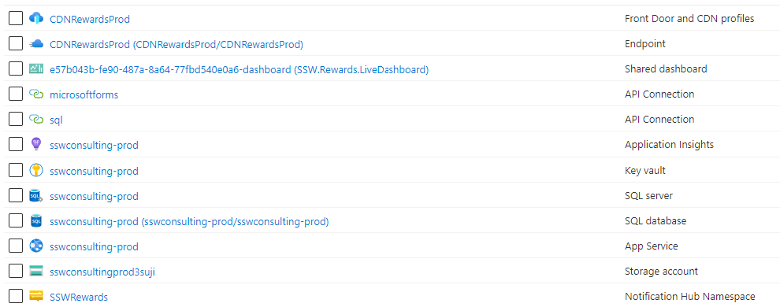
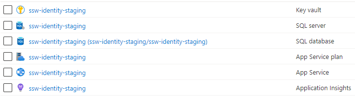

::: bad

:::

Organizing your cloud assets starts with good names. It is best to be consistent and use:

* all lower case 
* use kebab case (“-“ as a separator)
* include which environment the resource is intended for i.e. dev, test, prod, etc.
* do not include the Resource Type in the name (Azure will show this anyway)
* if applicable, include the intended use of the resource in the name e.g. an app service may have a suffix *api*

<!--endintro-->

Azure defines [some best practices for naming and tagging your resource](https://docs.microsoft.com/en-us/azure/cloud-adoption-framework/ready/azure-best-practices/naming-and-tagging).

Having inconsistent resource names across projects creates all sorts of pain 
* Developers will struggle to find a project's resources and identify what those resources are being used for
* Developers won't know what to call new resources they need to create.
* You run the risk of creating duplicate resources created because a developer has no idea that another developer created the same thing 6 months ago, under a different name, in a different Resource Group!

### Keep your resources consistent
If you're looking for resources, it's much easier to have a pattern to search for. At a bare minimum, you should keep the name of the product in the resource name, so finding them in Azure is easy. One good option is to follow the "productname-environment" naming convention, and most importantly: keep it consistent!

::: bad

:::

### Name your resources according to their environment
Resource names can impact things like resource addresses/URLs. It's always a good idea to name your resources according to their environment, even when they exist in different Subscriptions/Resource Groups.

::: good

:::

### Plan for the exceptions
Some resources won't play nicely with your chosen naming convention (for instance, storage accounts do not accept kebab-case). Acknowledge these, and have a rule in place for how you will name these specific resources.

Want more Azure tips? [Check out our rule on Azure Resource Groups](https://www.ssw.com.au/rules/azure-naming-resource-groups).

