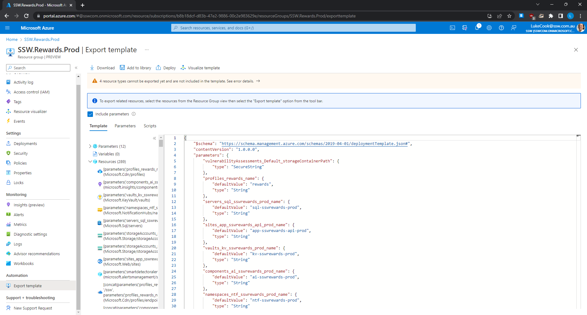
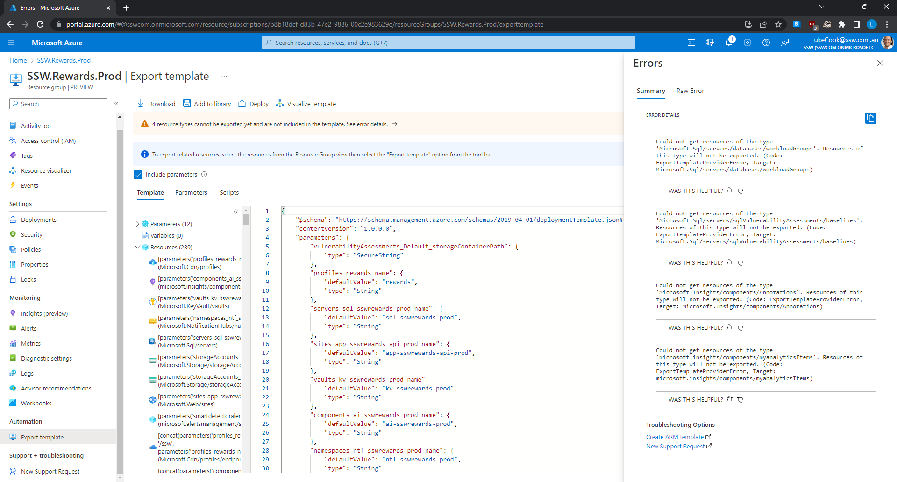

We've been down this road before where developers had to be taught not to manually create databases and tables. Now, in the cloud world, we're saying the same thing again:  **Don't manually create Azure resources.**

<!--endintro-->

### Manually Creating Resources

This is the most common and the worst. This is bad because it requires manual effort to reproduce and leaves margin for human error.

* Create resources in Azure and not save a script

::: bad

:::

### Manually creating and saving the script

Some people half solve the problem by manually creating and saving the script. This is also bad because it’s like eating ice cream and brushing your teeth – it doesn’t solve the **health** problem.

::: bad

:::

::: bad

:::

::: greybox
**Tip:** Save infrastructure scripts/templates in a folder called 'infra'.
:::

So if you aren't manually creating your Azure resources, what options do you have?

### Option A: Farmer

[Farmer - Making repeatable Azure deployments easy!](https://compositionalit.github.io/farmer/)

* IaC using F# as a strongly typed DSL
* Generates ARM templates from F#
* Add a very short and readable F# project in your solution
* Tip: The F# solution of scripts should be in a folder called Azure

`youtube: https://www.youtube.com/embed/8E63s2QlbhA`
**Figure: Farmer was our favourite until Bicep was supported by Microsoft**

### Option B: Bicep by Microsoft (recommended)

[Bicep - a declarative language for describing and deploying Azure resources](https://github.com/Azure/bicep)

* Is free and fully supported by Microsoft
* Has ['az' command line integration](https://docs.microsoft.com/en-us/cli/azure/bicep?view=azure-cli-latest)
* Awesome [extension](https://marketplace.visualstudio.com/items?itemName=ms-azuretools.vscode-bicep) for VS Code to author ARM Bicep files ⭐️
* Under the covers - Compiles into an ARM JSON template for deployment
* Much simpler syntax than ARM JSON
* Handles resource dependencies automatically
* [Private Module Registries](https://docs.microsoft.com/en-us/azure/azure-resource-manager/bicep/private-module-registry?tabs=azure-powershell) for publishing versioned and reusable architectures

::: greybox
**Tip:** If you are assigning any role assignment using bicep, make sure it doesn't exist before. (Using Azure Portal)
:::

**Announcement info:** [Project Bicep – Next Generation ARM Templates](https://devblogs.microsoft.com/devops/project-bicep-next-generation-arm-templates/)

**Example Bicep files:** [Fullstack Webapp made with Bicep](https://github.com/william-liebenberg/BicepFlex)

::: good

:::

### Option C: Enterprise configuration management $$$

The other option when moving to an automated Infrastructure as Code (IaC) solution is to move to a paid provider like [Pulumi](https://www.pulumi.com) or [Terraform](https://registry.terraform.io/providers/hashicorp/azurerm/latest/docs). These solutions are ideal if you are using multiple cloud providers or if you want to control the software installation as well as the infrastructure. 

* Both tools are great and have free tiers available
* Paid tiers provide more benefits for larger teams and helps manage larger infrastructure solutions
* Terraform uses HashiCorp Configuration Language HCL
  * like YAML but much more powerful
  * https://learn.hashicorp.com/tutorials/terraform/cdktf-install?in=terraform/cdktf
* Pulumi uses real code (C#, TypeScript, Go, and Python) as infrastructure rather than JSON/YAML

::: good

:::

::: good

:::

::: info
**Tip:** After you’ve made your changes, don’t forget to [visualize your new resources](/azure-resources-visualizing).
:::
