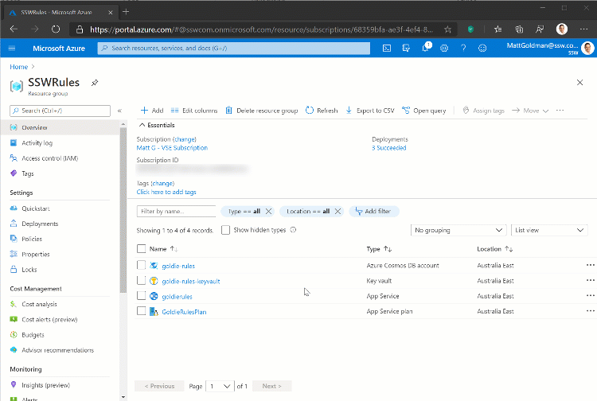
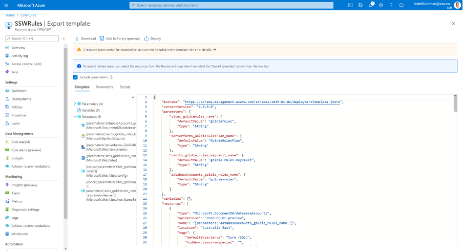
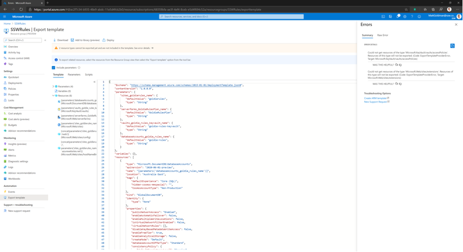
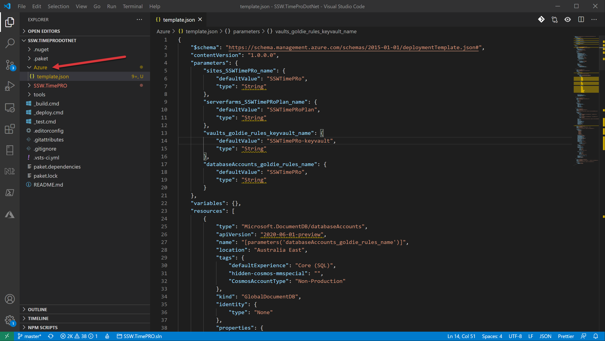
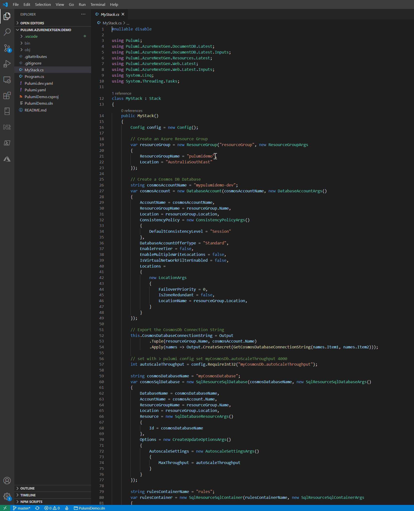
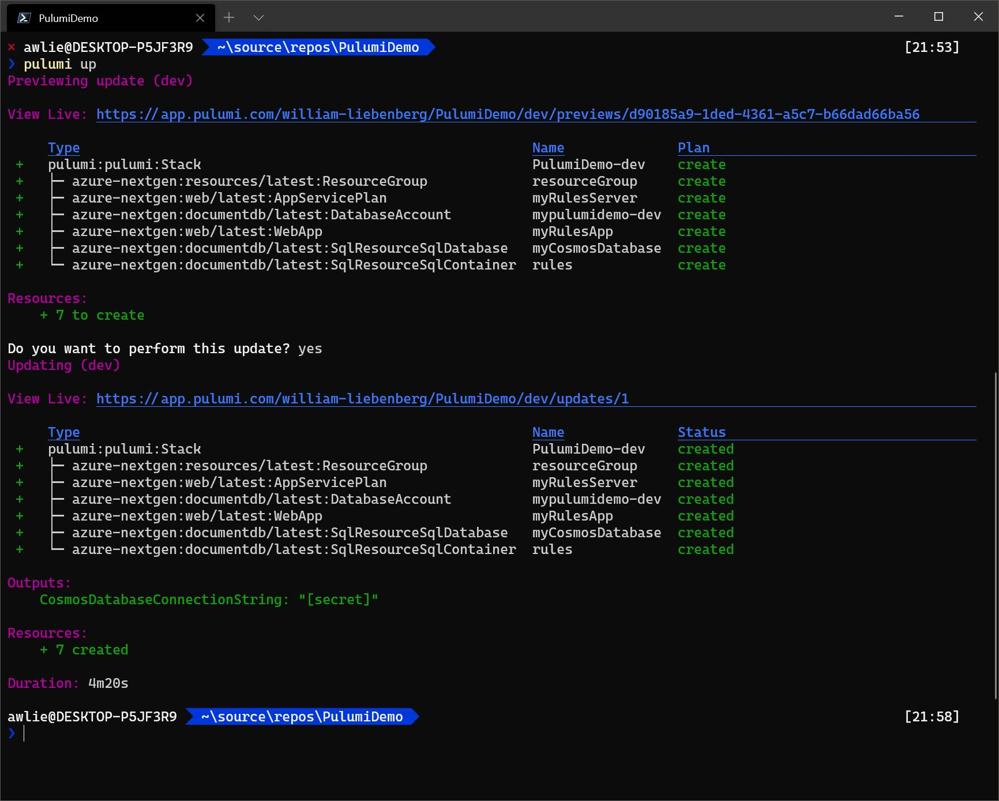

We’ve been down this road before where developers had to be taught not to manually create databases and tables. Now, in the cloud world, we’re saying the same thing again. **Don’t manually create your Azure resources.**

<!--endintro-->

### Manually Creating Resources

This is the most common and the worst. This is bad because it requires manual effort to reproduce and leaves margin for human error.

* Create resources in Azure and not save a script

::: bad  
  
:::

### Manually creating and saving the script

Some people half solve the problem by manually creating and saving the script. This is also bad because it’s like eating ice cream and brushing your teeth – it doesn’t solve the **health** problem.

::: bad  
  
:::

::: bad  
  
:::

::: greybox
 **Tip:** Save scripts in a folder called Azure  
:::

::: good  
  
:::

So if you aren't manually creating your Azure resources, what options do you have?

### Option A: Farmer

[https://compositionalit.github.io/farmer](https://compositionalit.github.io/farmer/)

* It makes creating ARM templates easier 
* It's a great tool
* Simply add a very short and readable F# project in your solution
* Tip: The F# solution of scripts should be in a folder called Azure

`youtube: https://www.youtube.com/embed/8E63s2QlbhA`
**Figure: Farmer was our favourite until Bicep was supported by Microsoft**

### Option B: Bicep by Microsoft (recommended)

[https://github.com/Azure/bicep](https://github.com/Azure/bicep)

* Is free and fully supported by Microsoft
* Has ['az' command line integration](https://docs.microsoft.com/en-us/cli/azure/bicep?view=azure-cli-latest)
* Compiles into an ARM template for deployment
* Much simpler syntax than ARM
* Handles dependencies automatically
* Easiest option if you are deploying Azure App Service or Azure Functions

More info: [Project Bicep – Next Generation ARM Templates](https://devblogs.microsoft.com/devops/project-bicep-next-generation-arm-templates/)

::: good

:::

### Option C: Enterprise configuration management $$$
The other option when moving to an automated Infrastructure as Code (IaC) solution is to move to a paid provider like [Pulumi](https://www.pulumi.com) or [Terraform](https://registry.terraform.io/providers/hashicorp/azurerm/latest/docs). These solutions are ideal if you are using multiple cloud providers or if you want to control the software installation as well as the infrastructure. 

* They're both great tools
* Both have free options for limited numbers of users
* Pulumi is better because:
    * Terraform's proprietary ‘HCL’ (Hashicorp Configuration Language), which is as bad as YAML
    * It's a great tool that uses real code (C#, TypeScript, Go, and Python) as infrastructure rather than JSON/YAML

::: good

:::

::: good

:::

::: info
**Tip:** After you’ve made your changes, don’t forget to [visualize your new resources](/azure-resources-visualizing)
:::
